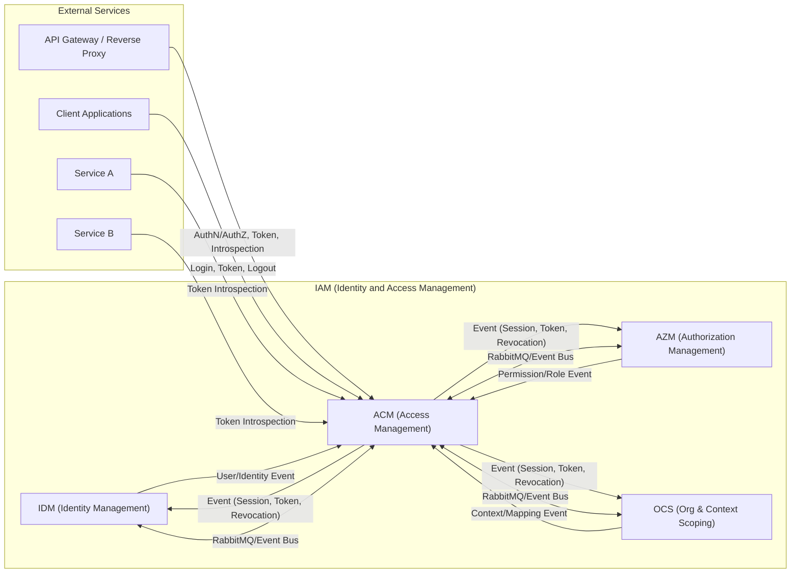
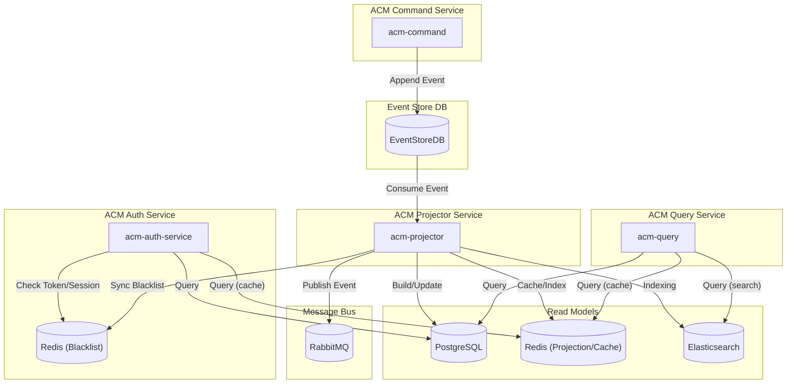

# Kiến trúc ACM (Access Management)

## 1. Giới thiệu & Phạm vi

ACM là sub-bounded context thuộc hệ IAM, chịu trách nhiệm quản lý vòng đời phiên đăng nhập (session), token truy cập (access/refresh token), kiểm soát thu hồi (revocation), và các cơ chế xác thực truy cập. ACM là authority cho việc phát hành, xác thực, thu hồi token và quản lý session.

## 2. Mục tiêu & Động lực

- Quản lý session, token, revocation một cách bảo mật, hiệu quả, mở rộng.
- Hỗ trợ các cơ chế xác thực hiện đại: JWT, Opaque Token, Token Rotation, Revoke Token Family.
- Đảm bảo khả năng thu hồi tức thì (instant revocation) và kiểm soát truy cập tập trung.

## 3. Sơ đồ quan hệ ACM với các Bounded Context và Service khác

## 3. Các yêu cầu chức năng và phi chức năng

### 3.1. Yêu cầu chức năng

- [Session Creation (Login)](./acm-use-cases.md#session-creation-login)
- [Refresh Token Rotation & Refresh](./acm-use-cases.md#token-refresh-and-rotation)
- [Logout and Session Revocation](./acm-use-cases.md#logout-and-session-revocation)
- [Family (fid) Revocation](./acm-use-cases.md#revocation-by-fid-family-invalidation)
- [Token Validation / Introspection](./acm-use-cases.md#token-validation--introspection)
- [Revocation Orchestration (Trigger Handling)](./acm-use-cases.md#handling-triggers-from-idmazmocs-revocation-orchestration)
- [OAuth Client Lifecycle](./acm-use-cases.md#oauth-client-management)
- [Token Revocation (RFC7009)](./acm-use-cases.md#token-revocation-rfc-7009)
- [Session Management](./acm-use-cases.md#session-management-list--get--revoke)
- [Client Credentials and Service Tokens](./acm-use-cases.md#client-credentials--service-tokens)
- [MFA Enforcement & Step-up](./acm-use-cases.md#mfa--step-up-authentication-acm-side)
- [Token Introspection](./acm-use-cases.md#introspection-endpoint-rfc-7662-like)
- [Refresh Token Lifecycle Clarifications](./acm-use-cases.md#clarify-refresh-token-lifecycle-and-reuse-handling)

### 3.2. Yêu cầu phi chức năng

**Yêu cầu phi chức năng (SLO/SLI):**

- **SLO về tính sẵn sàng:** Đảm bảo 99,95% thời gian hoạt động hàng tháng cho các endpoint phát hành và xác thực token.
- **SLI về độ trễ:** 95% các yêu cầu xác thực/introspection token hoàn thành trong vòng 100ms. _(Đo từ lúc server nhận request đến khi gửi response, chỉ tính thời gian phía server, không bao gồm thời gian mạng của client.)_
- **SLI về tính nhất quán:** 99% sự kiện thu hồi session/token được phản ánh lên read model trong vòng 2 giây.
- **SLO về bảo mật:** 100% token được phát hành bằng thuật toán an toàn (ví dụ: RS256/JWT, Opaque) và không lưu trữ secret thô trong event/projection.
- **SLO về khả năng mở rộng:** Hỗ trợ tối thiểu 1000 thao tác đăng nhập/phiên đồng thời với tỷ lệ lỗi < 1%.
- **SLO về khả năng kiểm toán:** 100% sự kiện vòng đời session/token được ghi log và truy vết đầy đủ.

## 4. Context Map

## 5. Sơ đồ triển khai

## 6. Các tài liệu tham khảo

- [ACM Domain Model](./acm-domain-model.md)
- [ACM Use Cases](./acm-use-cases.md)
- [ACM Roadmap](./acm-roadmap.md)
