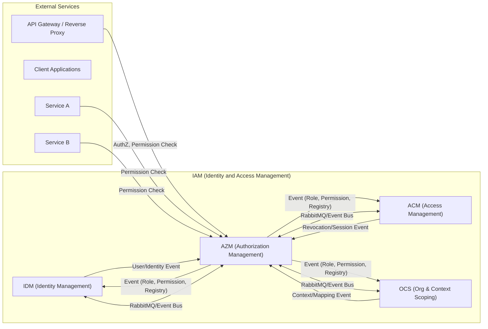
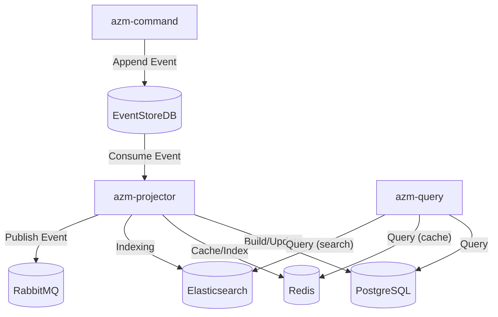

# Kiến trúc AZM (Authorization Management)

## 1. Giới thiệu & Phạm vi

AZM là sub-bounded context thuộc hệ IAM, chịu trách nhiệm quản lý role, permission, permission registry, và các cơ chế kiểm soát phân quyền động. AZM là authority cho việc định nghĩa, gán, và kiểm tra quyền truy cập trong toàn hệ thống.

## 2. Mục tiêu & Động lực

- Quản lý role, permission, registry một cách linh hoạt, mở rộng.
- Hỗ trợ các mô hình phân quyền: RBAC, DRBAC, policy-based, ...
- Đảm bảo khả năng kiểm soát truy cập động, audit, và traceability.

## 3. Context Map

## 4. Các yêu cầu chức năng và phi chức năng

### 4.1. Yêu cầu chức năng

- [Create Role](./azm-use-cases.md#create-role)
- [Update Role](./azm-use-cases.md#update-role-metadata)
- [Role Permissions Changed (trigger for revocation)](./azm-use-cases.md#role-permissions-change-trigger-for-revocation)
- [Delete Role](./azm-use-cases.md#role-delete-soft-delete)
- [Permission Registry (register / update / deprecate)](./azm-use-cases.md#permission-registry-register--update--deprecate)
- [Role Assignment Request (AZM -> OCS integration)](./azm-use-cases.md#role-assignment-request-azm---ocs-integration)
- [Guard Streams for Role uniqueness](./azm-use-cases.md#guard-streams--uniqueness-rolename-per-product)

### 4.2. Yêu cầu phi chức năng

**Yêu cầu phi chức năng (SLO/SLI):**

- **SLO về tính sẵn sàng:** Đảm bảo 99,95% thời gian hoạt động hàng tháng cho API quản lý role/permission.
- **SLI về độ trễ:** 95% các yêu cầu đọc role/permission hoàn thành trong vòng 100ms. _(Đo từ lúc server nhận request đến khi gửi response, chỉ tính thời gian phía server, không bao gồm thời gian mạng của client.)_
- **SLI về tính nhất quán:** 99% thay đổi permission/role được phản ánh lên projection trong vòng 2 giây.
- **SLO về bảo mật:** 100% thay đổi role/permission đều có thể kiểm toán và không lưu trữ secret thô trong event/projection.
- **SLO về khả năng mở rộng:** Hỗ trợ tối thiểu 500 thao tác role/permission đồng thời với tỷ lệ lỗi < 1%.
- **SLO về khả năng kiểm toán:** 100% sự kiện vòng đời permission/role được ghi log và truy vết đầy đủ.

## 5. Sơ đồ triển khai

## 6. Các tài liệu tham khảo

- [AZM Domain Model](./azm-domain-model.md)
- [AZM Use Cases](./azm-use-cases.md)
- [AZM Roadmap](./azm-roadmap.md)
