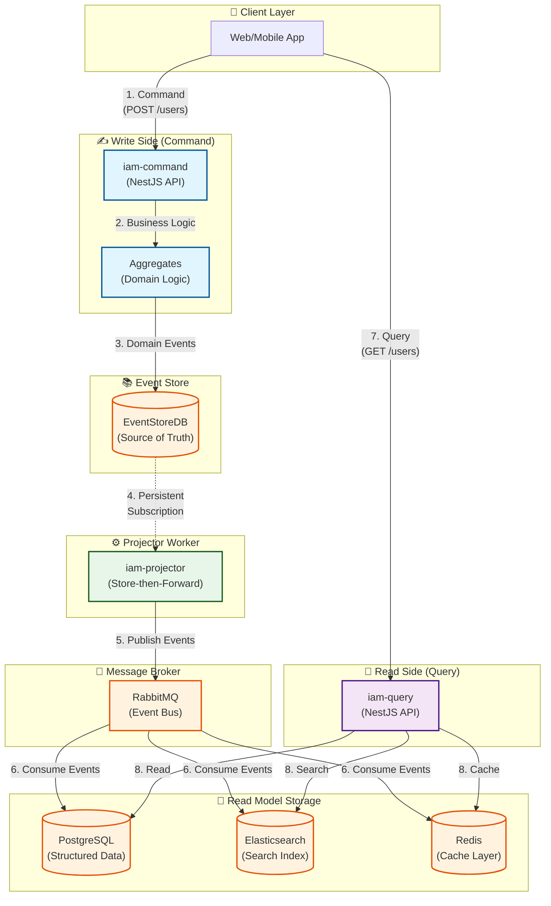
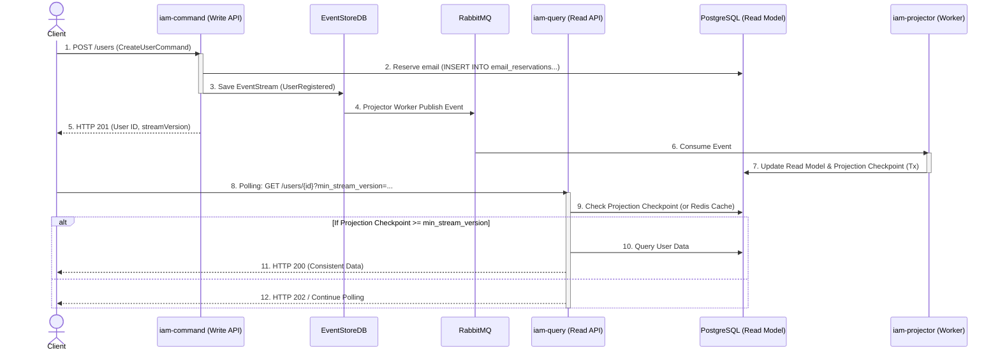
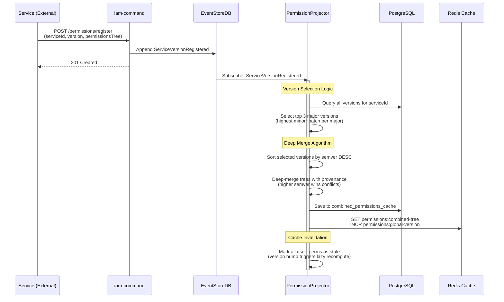
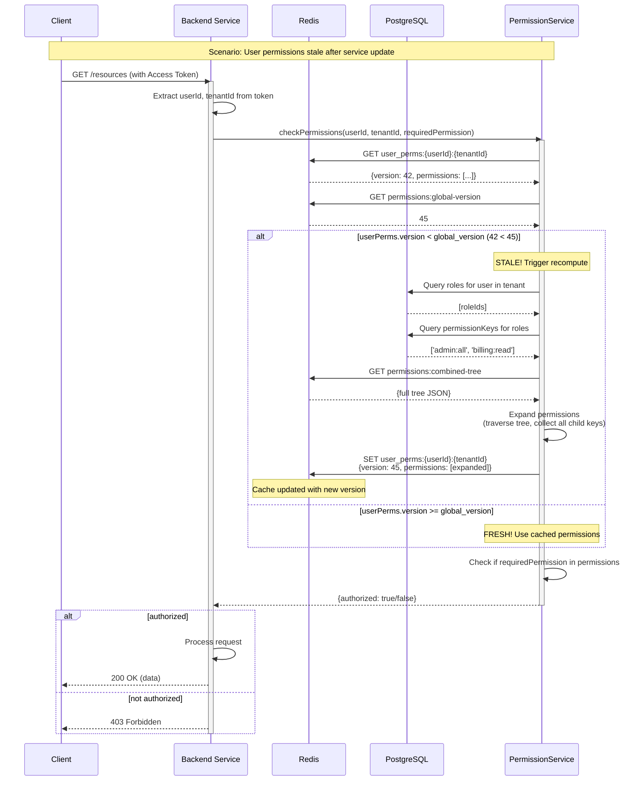

# Kiến trúc Bounded Context Quản lý Định danh và Truy cập (IAM)

## 1. Giới thiệu và Phạm vi

### 1.1. Mục tiêu và Động lực

Tài liệu này mô tả kiến trúc chi tiết cho Bounded Context IAM, một dịch vụ tập trung, hiệu suất cao và có khả năng mở rộng, chịu trách nhiệm quản lý vòng đời định danh, xác thực và phân quyền cho các dự án và dịch vụ trong hệ thống.

Kiến trúc của BC IAM tuân thủ và hướng tới các mục tiêu, nguyên tắc chung đã được mô tả trong `docs/architecture.md`. Cụ thể, IAM được thiết kế để phù hợp với:

- **Domain-Driven Design (DDD)** và **Clean Architect (Ports & Adapters)** để giữ domain thuần và testable.
- **CQRS + Event Sourcing** cho tách biệt Read/Write và khả năng auditability/replay.
- **Event-Driven Architecture (EDA)** với RabbitMQ làm backbone cho giao tiếp bất đồng bộ.
- **Chiến lược hạ tầng chia sẻ** (shared infra) và multi-tenancy theo các chỉ dẫn chung.
- **Observability & Security**: đảm bảo trace propagation (OTEL) trong metadata sự kiện và áp dụng cơ chế S2S tokens cho dịch vụ nội bộ.

Những điểm trên giúp IAM hòa nhập chặt chẽ với bức tranh kiến trúc tổng thể và giảm rủi ro vận hành khi tích hợp với các services khác trong monorepo. Ngoài ra chúng tôi cũng áp dụng nguyên tắc **Event Sourcing (ES)**. Sử dụng dòng sự kiện (event stream) làm nguồn chân lý (Source of Truth) duy nhất. Điều này cung cấp khả năng kiểm toán (auditability) hoàn chỉnh, cho phép tái tạo trạng thái và xây dựng lại các mô hình đọc bất cứ lúc nào.

### 1.2. Yêu cầu Chức năng Cốt lõi

- **Quản lý Người dùng (User Management):** Lưu trữ thông tin cơ bản của người dùng. User là thực thể chung (global) trong toàn tổ chức.

- **Quản lý Đa Tenancy (Multi-Tenancy):** Cung cấp registry cho các "namespace" (có thể là Tổ chức, Dự án). Một user có thể thuộc nhiều namespace với các vai trò khác nhau.

- **Permission Registry (Registry Quyền):**
  - Các dịch vụ có thể đăng ký các phiên bản quyền (permissions) của chúng.
  - Hỗ trợ quyền lồng nhau (nested permissions, ví dụ: `admin:user:read`).
  - Quyền cấp cao tự động bao gồm các quyền con.
  - Hệ thống luôn đọc và kết hợp (combine) 3 phiên bản major mới nhất của các quyền. Để hỗ tương thích với các thay đổi và phát triển dịch vụ nhanh chóng (bao gồm cả rollback nếu cần. Vì vậy mới sử dụng kết hợp 3 phiên bản chứ không phải 2).

- **Xác thực và Phân quyền (AuthN/AuthZ):**
  - Cung cấp chuẩn xác thực OAuth 2.0 và OIDC.
  - Cung cấp Single Sign-On (SSO) cho các ứng dụng web/mobile.
  - Hỗ trợ xác thực Service-to-Service (S2S).

- **Bảo mật Nâng cao:**
  - Hỗ trợ 2FA (TOTP/OTP).
  - Hỗ trợ Social Login (Google, Facebook, Github) và tự động mapping.

## 2. Lựa chọn và Giải trình Kiến trúc

### 2.1. Ghi chép Quyết định Kiến trúc (ADRs)

Ngoài việc tuân theo các quyết định kiến trúc chung đã được ghi lại trong [Kiến trúc tổng quan](../architecture.md), các quyết định cụ thể cho BC IAM được ghi lại trong các ADR sau:

**ADR-IAM-1: Lựa chọn Công nghệ (Technology Stack)**

- **Quyết định:** Sử dụng NestJS, Event Store DB cho Write Model, PostgreSQL cho Read Model dữ liệu có cấu trúc, Elasticsearch cho search, Redis cho cache, và RabbitMQ cho message bus.
- **Lý do:** Mỗi công nghệ được chọn để tối ưu cho use case cụ thể: Event Store DB native support cho Event Sourcing, PostgreSQL cho ACID và joins, Elasticsearch cho full-text search, Redis cho low-latency caching. Nhưng vân giữ được sự nhất quán với các lựa chọn công nghệ ở cấp độ kiến trúc tổng thể.

Chi tiết: [ADR-IAM-1 — Lựa chọn Công nghệ (Technology Stack)](../adr/ADR-IAM-1.md)

**ADR-IAM-2: Cơ chế Đọc Lại Bản Ghi Của Chính Mình (Read Your Own Writes - RYOW)**

- **Quyết định:** Implement RYOW mechanism thông qua checkpoint tracking và polling với timeout 500ms.
- **Lý do:** Giải quyết vấn đề UX khi user expect thấy thay đổi ngay lập tức sau khi thực hiện action. Polling approach đơn giản hơn các giải pháp phức tạp như synchronous projections hoặc WebSocket notifications.

Chi tiết: [ADR-IAM-2 — Cơ chế Đọc Lại Bản Ghi Của Chính Mình (RYOW)](../adr/ADR-IAM-2.md)

**ADR-IAM-3: Xử lý Lỗi Sự kiện và Tái Phát (Event Handling & Replay)**

- **Quyết định:** Implement chiến lược xử lý lỗi 3 tầng với Retry + DLQ, Event Upcasting và Full Replay mechanism.
- **Lý do:** Đảm bảo reliability với transient errors, hỗ trợ schema evolution qua upcasting, và cho phép rebuild Read Models khi cần sửa logic errors.

Chi tiết: [ADR-IAM-3 — Xử lý Lỗi Sự kiện và Tái Phát (Event Handling & Replay)](../adr/ADR-IAM-3.md)

**ADR-IAM-4: Quy tắc Merge Quyền (Permissions Merge Rules)**

- **Quyết định:** Áp dụng chính sách hợp nhất quyền có định nghĩa rõ ràng:

- Với mỗi service, chọn **3 giá trị major lớn nhất** hiện có (ví dụ: 4.x, 3.x, 2.x nếu các major đó tồn tại).
- Với mỗi major đã chọn, lấy release _latest_ trong major đó theo semver bằng cách: chọn bản có **highest minor**, và trong minor đó chọn **highest patch** (tức latest release trong major theo semver: highest minor → highest patch).
- Hợp nhất các `permissionsTree` của 3 release được chọn theo thứ tự ưu tiên: phiên bản có semver lớn hơn (major desc, minor desc, patch desc) thắng khi có xung đột. Quy tắc merge là deep‑merge (đệ quy), với các luật xử lý xung đột rõ ràng (leaf vs container, attributes override, provenance lưu lại để audit).

**Lý do:** Cách chọn này đảm bảo deterministic (dựa trên semver), ưu tiên các bản vá/patch mới nhất trong từng major, và hỗ trợ rollback theo major một cách rõ ràng. Ghi provenance cho mỗi node giúp audit và debug sau này.

Chi tiết: [ADR-IAM-4 — Quy tắc Merge Quyền (Permissions Merge Rules)](../adr/ADR-IAM-4.md)

**ADR-IAM-5: Chính sách Snapshot cho Aggregates (Snapshot Policy)**

- **Quyết định:** Hybrid snapshot policy dựa trên cả event count (N=100) và time threshold (T=24h), với phân tầng storage (inline vs blob) và versioning support.
- **Lý do:** Giảm ~90% thời gian rehydration cho long-lived aggregates trong khi optimize storage cost và hỗ trợ aggregate structural changes qua snapshot versioning.

Chi tiết: [ADR-IAM-5 — Chính sách Snapshot cho Aggregates (Snapshot Policy)](../adr/ADR-IAM-5.md)

**ADR-IAM-6: Ngữ nghĩa Checkpoint cho Projectors (Projection Checkpoint Semantics)**

- **Quyết định:** Per-projector, per-stream checkpoint được lưu trữ trong PostgreSQL (cùng transaction với Read Model) để đảm bảo tính nhất quán. Redis được sử dụng làm lớp Cache cho Checkpoint để phục vụ tra cứu nhanh (RYOW).
- **Lý do:** Đảm bảo at-least-once processing với no data loss, hỗ trợ RYOW mechanism, và cung cấp operational control cho pause/resume/rebuild workflows.

Chi tiết: [ADR-IAM-6 — Ngữ nghĩa Checkpoint cho Projectors (Projection Checkpoint Semantics)](../adr/ADR-IAM-6.md)

**ADR-IAM-7: Chiến lược Đảm bảo Tính duy nhất của email (Email Uniqueness Constraints)**

- **Quyết định:** Sử dụng mô hình "Reservation Pattern" (Đặt chỗ trước). Trước khi thực hiện lệnh tạo mới (ví dụ: CreateUser), hệ thống phải thực hiện giữ chỗ (reserve) giá trị duy nhất (như email, username) vào một bảng lookups trong PostgreSQL có ràng buộc UNIQUE. Nếu giữ chỗ thành công mới được phát sinh sự kiện vào EventStoreDB.
- **Lý do:** EventStoreDB là hệ thống append-only và không hỗ trợ ràng buộc duy nhất (consistency check) ngay tại thời điểm ghi. Việc sử dụng cơ chế lookup bên ngoài đảm bảo không có hai user được tạo ra với cùng một email, tuân thủ tính toàn vẹn dữ liệu.

Chi tiết: [ADR-IAM-7 — Chiến lược Đảm bảo Tính duy nhất của email (Email Uniqueness Constraints)](../adr/ADR-IAM-7.md)

**ADR-IAM-8: Quyết định Thuật toán Băm Mật khẩu (Password Hashing Algorithm)**

- **Quyết định:** Sử dụng `Argon2id` làm thuật toán băm mật khẩu mặc định cho hệ thống (production).
- **Lý do:** Argon2id là thuật toán cân bằng giữa kháng tấn công side-channel (id variant), memory-hard để giảm hiệu quả tấn công brute-force bằng phần cứng chuyên dụng, và có tham số cấu hình (time, memory, parallelism) cho việc scale theo phần cứng.

Chi tiết: [ADR-IAM-8 — Quyết định Thuật toán Băm Mật khẩu (Password Hashing Algorithm)](../adr/ADR-IAM-8.md)

**ADR-IAM-9: Shared Redis Token Blacklist (Token Revocation Store)**

- **Quyết định:** Sử dụng một instance Redis chia sẻ (shared Redis) làm "token blacklist" (revocation store) để lưu các Access Token (jti) và các token tham chiếu (reference token ids) bị thu hồi. IAM Service sẽ là thành phần viết (add/remove) vào blacklist; các service khác chỉ đọc (read-only) để thực hiện kiểm tra nhanh mà không cần gọi lại IAM.
- **Lý do:** Giữ token verification stateless (với JWT) trong phần lớn các luồng xử lý nhưng vẫn cung cấp cơ chế thu hồi (revocation) tức thời khi cần (logout, admin revoke, session revoke). Shared Redis cho phép các service kiểm tra blacklist rất nhanh (microsecond-level), giảm tải cho IAM và tránh một network hop cho mỗi request while supporting immediate revocation.

Chi tiết: [ADR-IAM-9 — Shared Redis Token Blacklist](../adr/ADR-IAM-9.md)

### 2.2. Sơ đồ Kiến trúc Cấp cao (CQRS/ES)

Kiến trúc tổng thể tách biệt hoàn toàn Write Side và Read Side:



**Giải thích các thành phần chính:**

- **iam-command (Write API):** Xử lý Commands, thực thi business logic qua Aggregates, lưu Domain Events vào EventStoreDB.
- **EventStoreDB:** Source of Truth, lưu trữ vĩnh viễn tất cả Domain Events theo dạng append-only stream.
- **iam-projector (Projector Worker):** Subscribe events từ EventStoreDB (Persistent Subscription), publish lên RabbitMQ theo pattern Store-then-Forward.
- **RabbitMQ:** Message Bus phân phối events đến các Projectors để cập nhật Read Models.
- **Read Models:** PostgreSQL (structured data), Elasticsearch (search), Redis (cache) - mỗi store được tối ưu cho use case riêng.
- **iam-query (Read API):** Phục vụ Queries từ Client, đọc dữ liệu từ Read Models đã được tối ưu.

### 2.3. Chi tiết Thành phần (Component Details)

#### 2.3.1. Write Side (iam-command)

**Luồng xử lý Command:**

1. Client gửi Command đến Write API.
2. CommandHandler xác thực Command và kiểm tra authorization.
3. Tải Aggregate Root từ EventStoreDB (replay events hoặc load từ snapshot).
4. Aggregate thực thi business logic, tạo Domain Events.
5. Repository lưu events vào EventStoreDB với optimistic concurrency check.
6. Trả về `streamVersion` cho Client (dùng cho RYOW mechanism).

**Đặc điểm kỹ thuật:**

- **Reservation Pattern:** Trước khi emit events, reserve unique constraints (email) vào PostgreSQL (xem [ADR-IAM-7](../adr/ADR-IAM-7.md)).
- **Idempotency:** Sử dụng `commandId` trong metadata để detect duplicate commands.
- **Timeout:** Command processing timeout default 5s, tối đa 30s cho complex operations.

#### 2.3.2. Projector Worker (Store-then-Forward Pattern)

**Projector Worker** (`apps/iam-projector`) là thành phần then chốt đảm bảo eventual consistency giữa Write Side và Read Side:

**Cơ chế hoạt động:**

- **Persistent Subscription:** Sử dụng Persistent Subscription của EventStoreDB để nhận events đã committed từ `$all` stream hoặc category streams.
- **Idempotency:** Worker kiểm tra `eventId` trước khi publish để tránh duplicate messages lên RabbitMQ.
- **ACK Semantics:** Worker chỉ ACK với EventStoreDB sau khi publish thành công lên RabbitMQ, đảm bảo at-least-once delivery.

**Xử lý Lỗi & Retry:**

- Khi publish thất bại (RabbitMQ down, network timeout), worker áp dụng exponential backoff và retry.
- Sau vượt quá ngưỡng retry (configurable, default 5 lần), event được ghi vào Dead Letter Queue (DLQ) và trigger alert.

**Monitoring & Observability:**

- **Metrics quan trọng:**
  - `subscription_publish_failures`: Số lần publish thất bại
  - `subscription_lag_events`: Số events chưa xử lý trong buffer
  - `subscription_publish_latency_ms`: Latency từ ESDB đến RabbitMQ

**Operational Runbook:**

- Khi worker down, events tích lũy trong subscription buffer.
- Restart worker sẽ tự động resume từ checkpoint cuối cùng được ACK.
- Không mất dữ liệu nhờ vào durability của EventStoreDB Persistent Subscription.

#### 2.3.3. Read Side (iam-query)

**Luồng xử lý Query:**

1. Client gửi Query đến Read API.
2. QueryHandler kiểm tra authorization (dựa trên cached permissions).
3. Truy vấn Read Model tương ứng:
   - **PostgreSQL:** Structured queries (joins, aggregations)
   - **Elasticsearch:** Full-text search, fuzzy matching
   - **Redis:** High-frequency cache lookups
4. Trả về kết quả cho Client.

**RYOW Support:**

- Client gửi `min_stream_version` header (nhận từ Write API response).
- QueryHandler kiểm tra projection checkpoint:
  - Nếu `checkpoint >= min_stream_version` → Trả dữ liệu ngay.
  - Nếu chưa đủ → HTTP 202 (Accepted), client polling lại.
- Timeout: 500ms (sau đó client retry hoặc fallback).

### 2.4. Luồng Tuần tự (Sequence Flows)

#### 2.4.1. Luồng Ghi & Tính nhất quán (Write Flow & RYOW)

Sơ đồ này minh họa luồng Command-to-Read Model và cơ chế Read Your Own Writes (RYOW) dựa trên `streamVersion` được trả về cho Client.



### 2.5. Tiêu chuẩn Xử lý Event Sourcing (ES Standards)

Việc áp dụng ES đòi hỏi các quy tắc nghiêm ngặt về quản lý vòng đời Event để đảm bảo khả năng Replay và Auditability.

#### A. Quản lý Phiên bản Event (Upcasting)

- **Luật Bất biến (Immutability):** Một Event đã được lưu trữ (persisted) **KHÔNG** BAO GIỜ được thay đổi.
- **Quy trình Thay đổi Schema:** Khi cần thay đổi schema của một Event, hãy tạo một **phiên bản mới** (ví dụ: `UserCreatedEventV2`).
- **Cơ chế Upcasting Bắt buộc:** Implement một hàm **Upcaster** (hoặc Migration Function) để chuyển đổi Event cũ (V1) thành cấu trúc Event mới (V2) **ngay trước khi** nó được Projector tiêu thụ hoặc được Aggregate Root Replay. Điều này đảm bảo tính tương thích ngược.

#### B. Quy tắc Snapshotting (Tối ưu hóa hiệu suất Replay)

Để tối ưu hóa hiệu suất tải Aggregate Root (AR), chúng ta sử dụng Snapshotting:

- **Ngưỡng Kích hoạt (Trigger Threshold):** Snapshot được tạo khi **bất kỳ** điều kiện sau thỏa mãn:
  - **Số sự kiện:** Đạt ngưỡng event count (default 100 events).
  - **Thời gian:** Đã qua 24 giờ kể từ snapshot cuối và có ít nhất 1 event mới.
  - **Per-Aggregate Overrides:** Mỗi loại Aggregate có thể có thresholds riêng:

| Aggregate Type | Event Count Threshold | Time Threshold | Lý do                                          |
| -------------- | --------------------- | -------------- | ---------------------------------------------- |
| User           | 50                    | 24h            | Users có nhiều actions (login, profile update) |
| Tenant         | 200                   | 24h            | Tenants ít thay đổi hơn                        |
| Role           | 150                   | 24h            | Moderate change frequency                      |
| Membership     | 100 (default)         | 24h            | Standard frequency                             |
| UserSession    | N/A                   | N/A            | Hybrid model, không dùng snapshot cho Refresh  |

- **Storage Strategy:** Snapshot nhỏ (<256KB) lưu inline trong EventStoreDB metadata. Snapshot lớn hơn lưu vào Blob Storage (S3/GCS) và chỉ lưu reference URI trong metadata.
- **Versioning:** Snapshot có `snapshotVersion` field để hỗ trợ migration khi Aggregate structure thay đổi. Khi load snapshot version cũ, áp dụng migration function trước khi replay events.

- **Quy trình Tải (Loading Process):** Khi gọi `load(AR_ID)`, dịch vụ Write API (iam-command) phải:
  1.  **Ưu tiên** tải Snapshot gần nhất.
  2.  Chỉ **Replay (áp dụng)** các sự kiện xảy ra **sau** Snapshot đó.

## 3. Mô hình Domain (Domain Model - DDD)

### 3.1. Tổng quan Aggregates (ARs)

- **User (AR - Global):** Đại diện cho định danh chung (global identity) của một người dùng.

- **UserSession (AR - Security):** Đại diện cho một phiên đăng nhập của người dùng (gắn liền với Refresh Token), dùng để quản lý việc thu hồi quyền truy cập (Revocation) và logout từ xa. Áp dụng mô hình Hybrid:
  - **Events (Event Sourcing):** Chỉ các sự kiện quan trọng được lưu vào EventStoreDB: `SessionCreated` (Login), `SessionRevoked` (Logout/ForceLogout).
  - **Direct Updates (Redis/Postgres):** Việc làm mới token (Refresh) chỉ cập nhật trực tiếp `expiresAt` vào Redis (`session:{sessionId}`) và Postgres Read Model, không tạo domain event. Điều này giảm 90%+ event volume cho Session aggregate.
  - **Performance Guidance:** Session Refresh có QPS rất cao (ví dụ: 10K req/s). Rate limiting khuyến nghị: 1 refresh/user/5s. Monitor `session_refresh_rate`, `session_revoke_total`.
  - **TTL & Cleanup:** Session keys trong Redis có TTL bằng Refresh Token expiry. Background sweeper job dọn dẹp expired sessions từ Postgres mỗi ngày.

- **Tenant (AR - Namespace/Scope):** Đại diện cho một phạm vi (scope) nghiệp vụ (Tổ chức, Dự án). Đây là đơn vị để phân tách Roles và Memberships.

- **Role (AR - Scoped):** Đại diện cho một tập hợp các quyền, luôn được gắn với một Tenant.

- **Membership (AR - Linking):** Liên kết một User (Global) với một Tenant (Scope) và gán các Role (Scoped) cho họ.

- **ServiceDefinition (AR):** Registry lưu trữ các phiên bản quyền (permissions tree) mà các dịch vụ khác đăng ký.

- **Application (AR):** Đại diện cho một OIDC/OAuth Client (dùng cho S2S hoặc ứng dụng bên thứ ba).

### 3.2 Định nghĩa Chi tiết ARs

**User (Aggregate Root - Global)**

| Trường        | Kiểu dữ liệu      | Mô tả                                          |
| ------------- | ----------------- | ---------------------------------------------- |
| `userId`      | UUIDv7            | Định danh người dùng duy nhất toàn hệ thống.   |
| `email`       | String (VO)       | Duy nhất, dùng cho xác thực và Social Mapping. |
| `profile`     | Value Object      | `firstName`, `lastName`, `avatarUrl`.          |
| `status`      | Enum              | `Active`, `Suspended`, `PendingVerification`.  |
| `socialLinks` | Entity Collection | `[{ provider, providerId, providerEmail }]`.   |
| `mfaMethods`  | Entity Collection | `[{ type: 'TOTP', secret, isEnabled }]`.       |

**Invariants (Bất biến):**

- Email phải là duy nhất trong toàn hệ thống (được đảm bảo bởi [ADR-IAM-7](../adr/ADR-IAM-7.md)).
- User mới tạo mặc định có status PendingVerification cho đến khi verify email (trừ trường hợp tạo qua social login thì coi như là đã verify - các dịch vụ social login phải lựa chọn các dịch vụ có verify email).

**UserSession (Aggregate Root - Security)**

_Đáp ứng yêu cầu: "Quản lý vòng đời phiên đăng nhập và khả năng thu hồi token (Force Logout)."_

| Trường             | Kiểu dữ liệu | Mô tả                                                                     |
| ------------------ | ------------ | ------------------------------------------------------------------------- |
| `sessionId`        | UUIDv7       | Định danh duy nhất của phiên (được nhúng trong claims của Refresh Token). |
| `userId`           | UUIDv7 (FK)  | Tham chiếu tới User (owner của phiên).                                    |
| `refreshTokenHash` | String       | Hash của refresh token (không lưu plaintext).                             |
| `userAgent`        | String?      | Định danh thiết bị (nếu có) để hiển thị/ quản lý phiên trên client.       |
| `ipAddress`        | String       | IP khi tạo phiên (dùng cho audit/security).                               |
| `countryCode`      | String?      | Mã quốc gia khi tạo phiên (dùng cho audit/security).                      |
| `expiresAt`        | DateTime     | Thời điểm phiên hết hạn (Refresh Token expiry).                           |
| `isRevoked`        | Boolean      | Trạng thái bị thu hồi (true nếu user logout hoặc admin block).            |

**Role (Aggregate Root - Scoped)**

_Đáp ứng yêu cầu: "Các role được tạo ra phải luôn được gắn mới một scope."_

| Trường           | Kiểu dữ liệu         | Mô tả                                                                                 |
| ---------------- | -------------------- | ------------------------------------------------------------------------------------- |
| `roleId`         | UUIDv7               | Định danh duy nhất cho Role.                                                          |
| `tenantId`       | UUIDv7(FK, NOT NULL) | Bắt buộc gắn Role với một Tenant (Namespace) cụ thể.                                  |
| `name`           | String               | Tên Role (ví dụ: "Project Admin").                                                    |
| `description`    | String               | Mô tả ngắn gọn về vai trò.                                                            |
| `permissionKeys` | List<String>         | Danh sách các key quyền được gán (dạng phẳng, e.g., `['admin:all', 'billing:read']`). |

**Membership (Aggregate Root - Linking)**

_Đáp ứng yêu cầu: "User có thể đồng thời thuộc về nhiều namespace/org."_

| Trường         | Kiểu dữ liệu | Mô tả                                                               |
| -------------- | ------------ | ------------------------------------------------------------------- |
| `membershipId` | UUIDv7       |                                                                     |
| `userId`       | UUIDv7 (FK)  | Liên kết đến User (Global).                                         |
| `tenantId`     | UUIDv7 (FK)  | Liên kết đến Tenant (Namespace).                                    |
| `roleIds`      | List<UUIDv7> | Danh sách các Role (Scoped) được gán cho User trong `tenantId` này. |

**Invariants (Bất biến):**

- Một User chỉ có tối đa một Membership trong một Tenant cụ thể.

**ServiceDefinition (Aggregate Root)**

| Trường      | Kiểu dữ liệu      | Mô tả                                             |
| ----------- | ----------------- | ------------------------------------------------- |
| `serviceId` | UUIDv7            | Định danh dịch vụ đăng ký quyền.                  |
| `name`      | String            | Tên dịch vụ (e.g., `billing-service`).            |
| `versions`  | Entity Collection | `[{ version: "1.0.0", permissionsTree: JSONB }]`. |

**Cấu trúc `permissionsTree` (JSONB):**

```json
[
  {
    "key": "admin:all",
    "description": "Quyền Quản trị Toàn cục",
    "children": [
      {
        "key": "admin:user",
        "description": "Quản lý Người dùng",
        "children": [{ "key": "admin:user:read", "description": "Xem danh sách người dùng" }]
      }
    ]
  }
]
```

### 3.3. Domain Events (Sự kiện Nghiệp vụ)

- `UserRegistered` (userId, email, name, sourceProvider)

- `UserVerified` (userId, verificationMethod?, verifiedAt)

- `UserPasswordChanged` (userId)

- `UserMFAEnabled` (userId, method)

- `UserSocialLinked` (userId, provider, providerId)

- `TenantCreated` (tenantId, name, namespace)

- `UserAddedToTenant` (membershipId, userId, tenantId)

- `RoleAssignedToUser` (membershipId, roleId)

- `ServiceVersionRegistered` (serviceId, version, permissionsTree)

- `RoleCreated` (roleId, tenantId, name, permissionKeys)

- `ApplicationRegistered` (clientId, name)

### 3.4 Value Objects

Các Value Object (VO) là thành phần quan trọng trong domain của IAM — chúng đảm bảo dữ liệu nguyên tử có tính hợp lệ, normalized và dễ so sánh. Dưới đây là tóm tắt các VO hiện có trong `domains/iam-domain/src/lib/value-objects` cùng các ràng buộc chính và API công khai (factory + helpers).

- **Email**
  - Mô tả: đại diện địa chỉ email, luôn được normalize (lowercase + trim).
  - Validation: không rỗng, tuân theo regex đơn giản (RFC-like), tối đa 255 ký tự.
  - API: `Email.create(email: string): Email`, `toString()` và `equals(...)`.
  - Exceptions: `EmailEmptyException`, `EmailPatternException`, `EmailTooLongException`.

- **NamespaceId**
  - Mô tả: định danh tenant/namespace an toàn cho URL.
  - Validation: lowercase, bắt đầu bằng chữ cái, chỉ chứa alphanumeric và hyphen; không có `--`; không kết thúc bằng `-`; chiều dài 3–63; một số namespace như `admin`, `api`, `www` bị reserved.
  - API: `NamespaceId.create(namespace: string): NamespaceId`, `toString()`, `equals(...)`.
  - Exceptions: `NamespaceEmptyException`, `NamespaceFormatException`, `NamespaceTooShortException`, `NamespaceTooLongException`, `NamespaceConsecutiveHyphensException`, `NamespaceEndsWithHyphenException`, `NamespaceReservedException`.

- **Password**
  - Mô tả: VO lưu trữ hash mật khẩu (không lưu plaintext). Có factory cho plaintext và cho hash khi load từ storage.
  - Validation (createFromPlaintext): không rỗng, độ dài 8–128, phải đạt ít nhất 3/4 nhóm ký tự (lower, upper, digit, special). Hashing: production bắt buộc sử dụng `Argon2id` theo quyết định kiến trúc (xem [ADR-IAM-8](../adr/ADR-IAM-8.md)). Ghi chú ngắn: lưu hash theo chuẩn `$argon2id$...` hoặc lưu cấu trúc bao gồm `algorithm`, `params`, `salt`, `hash`; hỗ trợ migration từ hash cũ qua cơ chế rehash-on-login và flag version trong record.
  - API: `Password.createFromPlaintext(plaintext: string): Password`, `Password.createFromHash(hash: string): Password`, `verify(plaintext)`, `toHash()`, `equals(...)`.
  - Exceptions: `PasswordEmptyException`, `PasswordTooShortException`, `PasswordTooLongException`, `PasswordWeakException`, `PasswordHashEmptyException`.

- **PermissionKey**
  - Mô tả: khóa quyền phân cấp, ví dụ `users:read` hoặc `tenants:admin:write`.
  - Validation: không rỗng, lowercase, chỉ alphanumeric và dấu `:`, không có leading/trailing colon; tối thiểu 2 phần (resource:action), tối đa 5 levels, tối đa 255 ký tự.
  - API: `PermissionKey.create(key: string): PermissionKey`, `toString()`, `matches(pattern: string): boolean`, `getResource()`, `getAction()`, `equals(...)`.
  - Exceptions: `PermissionKeyEmptyException`, `PermissionKeyFormatException`, `PermissionKeyLevelException`, `PermissionKeyTooLongException`.

- **PhoneNumber**
  - Mô tả: số điện thoại theo chuẩn E.164 (ví dụ `+14155552671`).
  - Validation: không rỗng, regex E.164: `^\+[1-9]\d{1,14}$`.
  - API: `PhoneNumber.create(phone: string): PhoneNumber`, `toString()`, `equals(...)`.
  - Exceptions: `PhoneNumberEmptyException`, `PhoneNumberFormatException`.

- **RoleName**
  - Mô tả: tên role trong tenant, cho phép ký tự chữ-số, khoảng trắng, hyphen, underscore.
  - Validation: không rỗng, dài 2–100 ký tự, bắt đầu bằng alphanumeric; regex: `^[a-zA-Z0-9][a-zA-Z0-9 _-]*$`.
  - API: `RoleName.create(name: string): RoleName`, `toString()`, `equals(...)`.
  - Exceptions: `RoleNameEmptyException`, `RoleNameTooShortException`, `RoleNameTooLongException`, `RoleNameFormatException`.

- **ServiceName**
  - Mô tả: identifier cho dịch vụ trong permission registry (dùng trong `ServiceDefinition`).
  - Validation: lowercase, bắt đầu bằng chữ cái, chỉ alphanumeric và hyphen; không có `--`; không kết thúc bằng `-`; chiều dài 3–50.
  - API: `ServiceName.create(name: string): ServiceName`, `toString()`, `equals(...)`.
  - Exceptions: `ServiceNameEmptyException`, `ServiceNameFormatException`, `ServiceNameTooShortException`, `ServiceNameTooLongException`, `ServiceNameConsecutiveHyphensException`, `ServiceNameEndsWithHyphenException`.

Ghi chú:

- Các VO triển khai `equals(...)` dựa trên `ValueObject` trong thư viện `packages/domain` để dễ so sánh trong các unit test và khi rehydrate aggregates.
- Khi cần mở rộng (ví dụ: thêm `Email.verified` flag hoặc policy hashing upgrades), khuyến nghị thêm phương thức tạo/phép chuyển đổi hợp lệ thay vì sửa constructor — giữ bất biến (immutability).
- Thư mục `domains/iam-domain/src/lib/value-objects` chứa cả file `.test.ts` tương ứng — bạn có thể tham khảo các test để biết ví dụ hợp lệ/không hợp lệ cho mỗi VO.

### 3.5. Domain Exceptions

Domain Exceptions là các exception được throw từ Value Objects hoặc Aggregate Roots khi vi phạm business rules hoặc invariants. Tất cả domain exceptions kế thừa từ `DomainException` (base class trong `@ecoma-io/domain`), cho phép application layer bắt và xử lý một cách nhất quán.

**Cấu trúc phân cấp:** Mỗi Value Object có một base exception (ví dụ: `EmailInvalidException`, `PasswordInvalidException`) và các specific exceptions kế thừa từ base để thể hiện lỗi cụ thể (ví dụ: `EmailEmptyException extends EmailInvalidException`).

**Vị trí:** `domains/iam-domain/src/lib/exceptions/`

#### 3.5.1. Email Exceptions

| Exception Class         | Mô tả                                    | Khi nào throw                                  |
| ----------------------- | ---------------------------------------- | ---------------------------------------------- |
| `EmailInvalidException` | Base exception cho tất cả lỗi Email      | Generic email validation failure               |
| `EmailEmptyException`   | Email bị rỗng hoặc chỉ chứa whitespace   | Input là `''`, `null`, `undefined`, hoặc `' '` |
| `EmailPatternException` | Email không match RFC-like regex pattern | Thiếu `@`, domain không hợp lệ                 |
| `EmailTooLongException` | Email vượt quá 255 ký tự                 | Length > 255 sau khi trim                      |

#### 3.5.2. NamespaceId Exceptions

| Exception Class                        | Mô tả                                          | Khi nào throw                                  |
| -------------------------------------- | ---------------------------------------------- | ---------------------------------------------- |
| `NamespaceInvalidException`            | Base exception cho namespace validation errors | Generic namespace validation failure           |
| `NamespaceEmptyException`              | Namespace bị rỗng                              | Input là `''`, `null`, hoặc `undefined`        |
| `NamespaceFormatException`             | Format không hợp lệ                            | Chứa ký tự không cho phép, không lowercase     |
| `NamespaceTooShortException`           | Namespace quá ngắn (< 3 ký tự)                 | Length < 3                                     |
| `NamespaceTooLongException`            | Namespace quá dài (> 63 ký tự)                 | Length > 63                                    |
| `NamespaceConsecutiveHyphensException` | Chứa `--` (hyphen liên tiếp)                   | Detect pattern `--` trong string               |
| `NamespaceEndsWithHyphenException`     | Kết thúc bằng `-`                              | Namespace tận cùng là hyphen                   |
| `NamespaceReservedException`           | Namespace nằm trong reserved list              | Input là `admin`, `api`, `www`, `root`, `auth` |

#### 3.5.3. Password Exceptions

| Exception Class              | Mô tả                                         | Khi nào throw                                    |
| ---------------------------- | --------------------------------------------- | ------------------------------------------------ |
| `PasswordInvalidException`   | Base exception cho password validation errors | Generic password validation failure              |
| `PasswordEmptyException`     | Password rỗng                                 | Input là `''`, `null`, hoặc `undefined`          |
| `PasswordTooShortException`  | Password < 8 ký tự                            | Length < 8                                       |
| `PasswordTooLongException`   | Password > 128 ký tự                          | Length > 128                                     |
| `PasswordWeakException`      | Password không đạt complexity requirements    | Không đủ 3/4 nhóm (lower, upper, digit, special) |
| `PasswordHashEmptyException` | Hash rỗng khi load từ storage                 | `Password.createFromHash('')` được gọi           |

#### 3.5.4. PermissionKey Exceptions

| Exception Class                 | Mô tả                                    | Khi nào throw                                         |
| ------------------------------- | ---------------------------------------- | ----------------------------------------------------- |
| `PermissionKeyInvalidException` | Base exception cho permission key errors | Generic permission key validation failure             |
| `PermissionKeyEmptyException`   | Permission key rỗng                      | Input là `''`, `null`, hoặc `undefined`               |
| `PermissionKeyFormatException`  | Format không hợp lệ                      | Không đúng pattern `resource:action`, có `:` đầu/cuối |
| `PermissionKeyLevelException`   | Số levels không hợp lệ                   | < 2 phần hoặc > 5 phần (split by `:`)                 |
| `PermissionKeyTooLongException` | Key vượt quá 255 ký tự                   | Length > 255                                          |

#### 3.5.5. PhoneNumber Exceptions

| Exception Class               | Mô tả                                  | Khi nào throw                                   |
| ----------------------------- | -------------------------------------- | ----------------------------------------------- |
| `PhoneNumberInvalidException` | Base exception cho phone number errors | Generic phone number validation failure         |
| `PhoneNumberEmptyException`   | Phone number rỗng                      | Input là `''`, `null`, hoặc `undefined`         |
| `PhoneNumberFormatException`  | Không match E.164 format               | Thiếu `+`, chứa ký tự không phải số, độ dài sai |

#### 3.5.6. RoleName Exceptions

| Exception Class             | Mô tả                               | Khi nào throw                                                       |
| --------------------------- | ----------------------------------- | ------------------------------------------------------------------- |
| `RoleNameInvalidException`  | Base exception cho role name errors | Generic role name validation failure                                |
| `RoleNameEmptyException`    | Role name rỗng                      | Input là `''`, `null`, hoặc `undefined`                             |
| `RoleNameTooShortException` | Role name < 2 ký tự                 | Length < 2                                                          |
| `RoleNameTooLongException`  | Role name > 100 ký tự               | Length > 100                                                        |
| `RoleNameFormatException`   | Format không hợp lệ                 | Không bắt đầu bằng alphanumeric, chứa ký tự đặc biệt không cho phép |

#### 3.5.7. ServiceName Exceptions

| Exception Class                          | Mô tả                                  | Khi nào throw                              |
| ---------------------------------------- | -------------------------------------- | ------------------------------------------ |
| `ServiceNameInvalidException`            | Base exception cho service name errors | Generic service name validation failure    |
| `ServiceNameEmptyException`              | Service name rỗng                      | Input là `''`, `null`, hoặc `undefined`    |
| `ServiceNameFormatException`             | Format không hợp lệ                    | Không lowercase, chứa ký tự không cho phép |
| `ServiceNameTooShortException`           | Service name < 3 ký tự                 | Length < 3                                 |
| `ServiceNameTooLongException`            | Service name > 50 ký tự                | Length > 50                                |
| `ServiceNameConsecutiveHyphensException` | Chứa `--` (hyphen liên tiếp)           | Detect pattern `--` trong string           |
| `ServiceNameEndsWithHyphenException`     | Kết thúc bằng `-`                      | Service name tận cùng là hyphen            |

### 3.6. Domain Services

Domain Services là các service chứa business logic không thuộc về một Aggregate cụ thể hoặc phối hợp nhiều Aggregates. Tất cả Domain Services đều được định nghĩa dưới dạng **interface** trong domain layer (`domains/iam-domain/src/lib/services`), với implementation cụ thể nằm ở infrastructure layer (`adapters/iam-infrastructure`) hoặc là pure functions trong domain (nếu không cần I/O).

**Nguyên tắc thiết kế:**

- Domain Service chỉ chứa business logic thuần túy, không có side effects trực tiếp
- Interface trong domain layer tuân thủ Dependency Inversion Principle (Clean Architect)
- Implementation có thể là pure function (no I/O) hoặc adapter (với I/O dependencies)

| Domain Service                                             | Mục đích                                                                                                             | Kế thừa từ base                                     | Vị trí Implementation                      | Ghi chú                                                                                                    |
| ---------------------------------------------------------- | -------------------------------------------------------------------------------------------------------------------- | --------------------------------------------------- | ------------------------------------------ | ---------------------------------------------------------------------------------------------------------- |
| **IUniqueValueReservationService<br/>(Email Reservation)** | Đảm bảo tính duy nhất của email trong hệ thống Event Sourcing thông qua Reservation Pattern (ADR-IAM-7)              | `IReservation<Email, string>` từ `@ecoma-io/domain` | `adapters/iam-infrastructure` (Postgres)   | Orchestrated trong Command Handler: reserve → append event → confirm. Critical path operation.             |
| **IPermissionMergeService**                                | Hợp nhất permission trees từ 3 major versions mới nhất theo semver rules với provenance tracking (ADR-IAM-4)         | None (custom interface)                             | `domains/iam-domain` (pure function)       | Pure domain algorithm, no I/O. Called by PermissionProjector sau khi load versions từ Read Model.          |
| **IPermissionExpansionService**                            | Mở rộng permission keys để bao gồm tất cả quyền con (nested permissions) theo rule "quyền cao bao gồm quyền thấp"    | None (custom interface)                             | `domains/iam-domain` (pure function)       | Pure tree traversal algorithm. Used in authorization checks, token generation, user permission resolution. |
| **IPasswordHashingService**                                | Quản lý password hashing với Argon2id và rehash-on-login policy (ADR-IAM-8)                                          | `IHasher` từ `@ecoma-io/domain`                     | `adapters/iam-infrastructure` (Argon2 lib) | Domain gọi `needsRehash()` để quyết định emit `UserPasswordUpgraded` event. Security-critical service.     |
| **ISessionPolicyService**                                  | Enforce business rules cho Session lifecycle: TTL, refresh rate limits, max concurrent sessions, revocation criteria | `IPolicy<T>` từ `@ecoma-io/domain` (optional)       | `domains/iam-domain` (pure policy)         | Stateless policy evaluation. Support hybrid session model (Section 3.1). Rate limit: 1 refresh/user/5s.    |

**Quan hệ với các thành phần khác:**

- **Aggregates:** Aggregates có thể gọi Domain Services để kiểm tra policies hoặc thực hiện operations không thuộc aggregate boundary
- **Command Handlers:** Orchestrate Domain Services với Aggregates (e.g., reserve email → create User → confirm reservation)
- **Projectors:** Gọi Domain Services để compute derived data (e.g., merge permissions, expand keys)
- **Infrastructure Adapters:** Implement Domain Service interfaces với external dependencies (DB, crypto libs)

**Vị trí files:**

- Interfaces: `domains/iam-domain/src/lib/services/*.service.ts`
- Pure implementations: `domains/iam-domain/src/lib/services/impl/*.ts` (nếu có)
- Infrastructure implementations: `adapters/iam-infrastructure/src/services/*.service.ts`

## 4. Triển khai CQRS và EDA

### 4.1. Luồng Ghi (Write Side Flow)

1. **Client gửi Command** (ví dụ: `AssignRoleToUserCommand`) đến Write API.

2. **CommandHandler (NestJS)** xác thực Command.

3. Nó tải **Membership AR** từ Event Store DB (bằng cách replay các sự kiện của `membershipId` đó để tái tạo trạng thái).

4. Gọi phương thức nghiệp vụ: `membership.assignRole(roleId)`.

5. AR tạo ra sự kiện `RoleAssignedToUser` và giữ nó trong `uncommitted_events`.

6. **Repository** lưu sự kiện này vào stream trong Event Store DB (đảm bảo optimistic concurrency).

7. **Projector Worker** (`apps/iam-projector`) nhận sự kiện mới từ Event Store DB thông qua Persistent Subscription và phát (publish) lên RabbitMQ (Exchange: `iam.events`).

### 4.2. Luồng Đọc (Read Side Flow - Projectors)

Một (hoặc nhiều) Projector (NestJS Worker) lắng nghe các sự kiện từ RabbitMQ.

- **Projector Chính (PostgreSQL):**
  - Nhận `UserRegistered` -> `INSERT INTO users ...`

  - Nhận `RoleAssignedToUser` -> `INSERT INTO membership_roles (membership_id, role_id) ...`

- **Projector Tìm kiếm (Elasticsearch):**
  - Nhận `UserRegistered` -> `client.index('users', { userId, email, name }) ...`

- **Projector Quyền (Permission Projector):** (Xem mục 4.3)
  - Nhận `RoleAssignedToUser`, `UserAddedToTenant`, `RoleCreated` -> Đánh dấu phiên bản quyền người dùng cần cập nhật (Lazy Invalidation).

### 4.3. Logic Cốt lõi: Xử lý Quyền (Permission Resolution)

Đây là cơ chế phức tạp nhất, kết hợp yêu cầu "3 major versions" và "quyền lồng".

#### 4.3.0. Sơ đồ Tổng quan: Permission Merge Pipeline



**Giai đoạn 1: Tính toán Nền (Background Projection - Combined Tree)**

- **Kích hoạt:** Khi `ServiceVersionRegistered` event được nhận.

- **Hành động:** `PermissionProjector` được kích hoạt.

- **Logic:**
  a. Tải tất cả các `ServiceDefinition` từ Read Model (Postgres).
  b. Với mỗi dịch vụ, thực hiện chọn phiên bản như sau: - Lấy tập distinct các giá trị `major` có sẵn và sắp xếp theo thứ tự giảm dần (major cao → thấp). - Chọn **3 major lớn nhất** (ít hơn nếu dịch vụ có <3 major hiện có). - Với mỗi major được chọn, chọn release _latest_ trong major đó theo semver bằng cách lấy bản có **highest minor**, và trong minor đó chọn **highest patch** (tức latest release trong major theo semver: highest minor → highest patch).
  c. **Hợp nhất (Merge):** Projector hợp nhất các `permissionsTree` (JSONB) của các phiên bản đã chọn theo thứ tự ưu tiên giảm dần của semver (major desc → minor desc → patch desc). Quy tắc merge chính: - Thao tác là deep‑merge (đệ quy) trên cây; với mỗi node, provenance (nguồn service/version) được ghi lại. - Nếu một key chỉ tồn tại ở một nguồn → sao chép nguyên node và gán provenance. - Nếu key tồn tại ở nhiều nguồn: - Nếu cả hai là container (có children) → merge đệ quy children theo cùng quy tắc. - Nếu một bên là leaf và bên kia là container → mặc định **leaf (từ phiên bản có priority cao hơn) sẽ ghi đè** (explicit override). Trường hợp này phải được log và lưu provenance để audit. - Nếu cả hai là leaf → node từ phiên bản có semver cao hơn (theo priority order) ghi đè. - Các trường mô tả/metadata: chọn giá trị từ phiên bản priority cao hơn nhưng lưu giá trị trước đó trong `metadata.previous` để tra cứu. - Sau khi hợp nhất xong, lưu cây kết quả vào `combined_permissions_cache` (Postgres) và publish/đẩy vào Redis (Key: `permissions:combined-tree`) kèm `combined_version_id` và provenance summary.

- **Lưu trữ (Cache):**
  - Lưu cây JSON đã hợp nhất vào PostgreSQL: `combined_permissions_cache`.

  - Đẩy cây JSON này vào Redis (Key: `permissions:combined-tree`) và cập nhật `global_permission_version`.

**Cache Invalidation Strategy (Lazy Recompute):**

Khi `combined_permissions_cache` thay đổi (do `ServiceVersionRegistered`), hệ thống không tính toán lại ngay tất cả `user_perms` mà áp dụng **Lazy Invalidation với Versioning**:

- **Versioning:** Mỗi lần cập nhật `combined-tree`, tăng `global_permission_version` (counter trong Redis key `permissions:global-version`).
- **User Cache Schema:** Key `user_perms:{userId}:{tenantId}` lưu cấu trúc:
  ```json
  {
    "version": 42,
    "permissions": ["admin:all", "admin:user:read", ...],
    "computedAt": "2025-11-20T10:00:00Z"
  }
  ```
- **Lazy Recompute Flow:** Khi middleware/service check quyền:
  1. Đọc `user_perms:{userId}:{tenantId}` từ Redis.
  2. So sánh `userPerms.version` với `global_permission_version`.
  3. Nếu `userPerms.version < global_permission_version` → stale → trigger recompute on-the-fly (fetch roles, expand permissions, cache lại với version mới).
  4. Trả về permissions đã được làm mới.
- **TTL:** Đặt TTL cho `user_perms` keys (khuyến nghị 24h) để tự động cleanup inactive users.
- **Background Precompute (Optional):** Có thể chạy background job để precompute cho high-traffic users dựa trên access logs.
- **Metrics:** `permission_cache_hit_rate`, `permission_recompute_latency_ms`, `permission_version_mismatch_total`.

**Giai đoạn 2: Giải quyết Quyền User (User Permission Resolution)**

- **Kích hoạt:** Khi `RoleAssignedToUser` xảy ra, hoặc `RoleCreated` (với `permissionKeys` thay đổi), hoặc `UserAddedToTenant`.

- **Hành động:** `UserPermissionProjector` được kích hoạt.

- **Input:** `userId`, `tenantId` (từ sự kiện).

- **Logic:**
  a. **Lazy Loading:** Khi truy cập, so sánh version trong cache user với `global_permission_version`. Nếu cũ hơn -> Tính toán lại.
  b. **Tải Keys:** Lấy tất cả `permissionKeys` (dạng phẳng) từ các Role mà User được gán trong Tenant đó. (Ví dụ: `P_keys = {'admin:all', 'billing:read'}`).
  c. **Tải Cây Quyền:** Đọc `permissions:combined-tree` từ Redis (đã được Giai đoạn 1 chuẩn bị).
  d. **Mở rộng Quyền (Expansion):** \* Duyệt qua mỗi key `P` trong `P_keys`. \* Đáp ứng yêu cầu: "Quyền cấp cao tự động bao gồm quyền con." \* Sử dụng Cây Quyền, tìm tất cả các key con (đệ quy) bên dưới `P` (ví dụ: `admin` -> `admin:user`, `admin:user:read`). \* Thêm tất cả key con đã tìm thấy vào một Set cuối cùng (đã mở rộng và làm phẳng).

- **Lưu trữ (Cache):**
  - Lưu Set quyền cuối cùng này vào Redis (Key: `user_perms:{userId}:{tenantId}`) kèm version.

#### 4.3.1. Sơ đồ Chi tiết: Lazy Invalidation & Recompute-on-Access



**Giai đoạn 3: Kiểm tra Quyền (Live Access Check)**

1. Client gọi API với Access Token (JWT).
2. API Gateway/Backend Service xác thực Token (Stateless) và kiểm tra Blacklist (Redis).
3. Kiểm tra quyền dựa trên `scope` hoặc `permissions` claim có trong Token (được giới hạn theo Tenant/Project).
4. Nếu Token hợp lệ, không nằm trong Blacklist và có đủ quyền -> Cho phép truy cập.

Lưu ý quan trọng:

- Dữ liệu về blacklist token sẽ được lưu trong shared redis instance để tất cả các instance của IAM service có thể truy cập với prefix key `access_token_blacklist_{jti}`.

### 4.4 Luồng User Registration — Reservation & Verification

Phần này mô tả luồng đăng ký người dùng khi hệ thống dùng PostgreSQL `email_reservations` để đảm bảo tính duy nhất của email, xử lý tình huống đăng ký nhiều lần khi email chưa được verify, và cơ chế gửi email xác thực bất đồng bộ.

Tóm tắt chính sách

- Chuẩn hóa email (lowercase + trim) trước mọi kiểm tra.
- Bắt buộc header `Idempotency-Key` cho `POST /users` để đảm bảo idempotency trên đường tạo.
- `email_reservations` (Postgres) là nguồn chân lý cho uniqueness; Redis chỉ dùng như fast-path lock nếu cần.

Luồng CreateUser (tổng quan)

1. Normalize email.
2. Thử `INSERT` vào `email_reservations(email, reserved_by, idempotency_key, status='reserved', expires_at=now()+TTL)`.

- Nếu thành công → tiếp tục tạo user (append `UserRegistered` (PendingVerification) vào EventStoreDB).
- Nếu conflict UNIQUE → đọc reservation hiện tại:
  - `committed` → trả 409 `EMAIL_ALREADY_IN_USE`.
  - `reserved` / `pending_verification`:
    - Nếu `idempotency_key` hoặc `reserved_by` trùng → idempotent retry: (re)send verification, trả thông tin hiện có.
    - Nếu `expires_at < now()` → cố gắng chiếm lại với `UPDATE ... WHERE expires_at < now()`.
    - Ngược lại → trả 409 `EMAIL_ALREADY_RESERVED_PENDING_VERIFICATION` kèm metadata (`existing_user_id`, `status`, `expires_at`, `can_resend`).

3. Nếu append event thành công → `UPDATE email_reservations SET status='pending_verification', user_id=$userId, verification_sent_at=now()`.
4. Enqueue email xác thực (non-blocking). Nếu gửi thất bại, cho phép `resend` thông qua endpoint chuyên dụng.
5. Khi user verify token → append `UserVerified` event → `UPDATE email_reservations SET status='committed'`.

   TTL, Sweeper & Reconciliation
   - TTL cho `pending_verification`: configurable (e.g., 48–72h). Sweeper job:
     - Release expired reservations (set status='released') và emit `EmailReservationExpired` event.
     - Reconcile `reserved` entries không có event user tương ứng do partial-failure: retry append hoặc release.
   - Email dispatcher: queue với retry/backoff và DLQ; failures không block `POST /users`.

Observability & Alerts

- Metrics: `reservation_conflict_total`, `reservation_expired_total`, `email_send_dlq_total`, `pending_verification_gauge`.
- Alerts: spikes in reservation conflicts, email DLQ > 0, p95 verification latency beyond SLO.

Ghi chú vận hành

- Bắt buộc Idempotency-Key trên `POST /users`.

## 5. Chi tiết Giao thức và Bảo mật

### 5.1. OAuth 2.0 / OIDC Profile

- **Claims Chuẩn:** Tuân thủ OIDC (`openid`, `profile`, `email`).

- **Scopes Chuẩn:** `openid`, `profile`, `email`, `offline_access`.

- **Scopes Động (Dynamic Scopes):**
  - Các Client (`Application` AR) có thể yêu cầu các Scopes tương ứng với permission keys (ví dụ: `scope="openid profile admin:user:read"`).
  - Khi cấp token, IAM Service (OIDC Provider) sẽ kiểm tra Set quyền đã được giải quyết trong Redis (mục 4.3). Chỉ các Scopes mà user thực sự có quyền mới được cấp trong Access Token.
  - Khi cấp token, IAM Service (OIDC Provider) sẽ kiểm tra Set quyền đã được giải quyết trong Redis (mục 4.3). Chỉ các Scopes mà user thực sự có quyền mới được cấp trong Access Token.
  - **Access Token `scope` will contain the full set of resolved permission keys** for the subject. Monitor token size and expiry trade-offs: large permission sets may increase token size (transport and storage), so tune token TTL and monitoring accordingly.

**Token Size Mitigation Strategies:**

Khi permission set lớn (>50 keys), token size có thể vượt 8KB và gây vấn đề với HTTP headers/cookies:

- **Reference Tokens:** Với users có quyền phức tạp, cấp Reference Token (opaque token) thay vì JWT. Backend call IAM service để introspect token và lấy permissions. Trade-off: thêm 1 network hop nhưng giảm token size.
- **Scope Compression:** Nén permission keys bằng cách chỉ lưu high-level permissions trong token, services tự expand khi cần (requires coordination).
- **Short TTL:** Access Token với large scopes nên có TTL ngắn (5-15 phút) để giảm risk khi token bị leak.
- **Token Rotation:** Implement key rotation policy: OIDC signing keys rotate mỗi 90 ngày. Client secrets (S2S) rotate mỗi 180 ngày hoặc khi có incident.
- **Secret Storage:** Client secrets lưu trong secure vault (HashiCorp Vault, AWS Secrets Manager). Không commit vào code hoặc env files.
- **Monitoring:** Track `token_size_bytes` (p50/p95/p99), alert khi p95 > 6KB. Monitor `token_introspection_rate` nếu dùng reference tokens.

- **Luồng (Flows):**
  - Web/Mobile Apps: Authorization Code + PKCE (Bắt buộc).
  - Service-to-Service: Client Credentials.
- **Quản lý Phiên (Session Management):**
  - Refresh Token được map 1-1 với UserSession AR.
  - **Token Blacklist:** Sử dụng Shared Redis để lưu danh sách các Access Token (jti) bị thu hồi trước thời hạn (do Logout hoặc Force Revoke). Middleware xác thực phải kiểm tra Blacklist này. (Không phải là redis sidecar mà là shared instance để tất cả các instance của IAM service có thể truy cập.)
  - Khi thực hiện Refresh Access Token, hệ thống phải kiểm tra UserSession.isRevoked và User.status. Nếu Session bị revoke hoặc User bị Suspended, từ chối cấp token mới.
- **Cơ chế Nâng cấp Mật khẩu (Password Rehash):**
  - **Detection:** Khi đăng nhập thành công, sau khi `Password.verify(plaintext)` trả về `true`, hệ thống gọi `password.needsRehash()` để kiểm tra xem hash hiện tại có dùng tham số Argon2id thấp hơn cấu hình production mới không (ví dụ: memoryCost cũ 32MB < mới 64MB, hoặc timeCost cũ 2 < mới 3).
  - **Rehash Flow:** Nếu `needsRehash() === true`:
    1. Tạo hash mới từ plaintext với params mới: `newPassword = Password.createFromPlaintext(plaintext)`.
    2. Append domain event `UserPasswordUpgraded(userId, newHash, oldAlgorithmInfo)`.
    3. Update User aggregate và lưu event vào EventStoreDB.
  - **Non-blocking:** Rehash thực hiện sau khi user đã nhận access token, không ảnh hưởng login latency.
  - **Metrics & Monitoring:** Track `password_rehash_count`, `legacy_password_hashes_remaining_gauge`. Alert khi gauge không giảm sau nhiều tuần (có thể user inactive).
  - **Admin Bulk Rehash:** Không khuyến nghị force rehash hàng loạt. Thay vào đó, gửi email khuyến khích users login hoặc đặt policy yêu cầu password change sau 90 ngày.

### 5.2. Luồng S2S (Client Credentials)

1. Service A (ví dụ: Billing) dùng `clientId` và `clientSecret` của nó (lấy từ `Application` AR) để gọi IAM service.

2. IAM cấp một Access Token.

3. Đáp ứng yêu cầu: "Token S2S không cần phải có tenant cụ thể." -> Token S2S là Global. Khi gọi API, Service A truyền ngữ cảnh Tenant qua header `X-Tenant-ID`.

## 6. Triển khai và Vận hành (Deployment & Ops)

### 6.1. Mô hình Triển khai (Docker)

Hệ thống được đóng gói thành **4 Docker images** riêng biệt từ cùng một codebase NestJS (chạy với các entrypoint khác nhau) để đảm bảo khả năng mở rộng độc lập:

- **`apps/iam-migration` (Container 0):**
  - Chạy các migration cho Postgres, ES, Redis.
  - Chạy một lần khi khởi động (init container in k8s).

- **`apps/iam-command` (Container 1):**
  - Chạy NestJS API.

  - Chỉ expose các endpoint nhận Command (POST, PUT, DELETE).

  - Scale dựa trên lưu lượng ghi.

- **`apps/iam-query` (Container 2):**
  - Chạy NestJS API.

  - Chỉ expose các endpoint nhận Query (GET).

  - Scale dựa trên lưu lượng đọc.

- **`apps/iam-projector` (Container 3):**
  - Chạy NestJS Worker (không mở port HTTP).

  - Lắng nghe RabbitMQ và cập nhật Read Models (Postgres, ES, Redis).

  - Scale dựa trên backlog của RabbitMQ (số lượng sự kiện chờ xử lý).

### 6.2. Observability (Giám sát)

- Logging: Sử dụng Pino ghi log JSON ra `stdout` và thu thập qua ELK/OTel Collector. Nên chuẩn hóa các trường:
  - `traceId`, `spanId`, `correlationId`, `causationId`
  - `tenantId` (tid), `userId`/`clientId` (sub/azp), `ip`
  - `aggregateId`, `aggregateType`, `streamName`, `eventType`, `eventVersion`
  - `projectorName`, `checkpointVersion`, `retryCount`, `dlq`

- Tracing: Tích hợp OpenTelemetry cho toàn tuyến HTTP → Command API → EventStoreDB → Message Broker → Projectors → Read API.
  - Truyền `traceparent`/`tracestate` theo W3C Trace Context trong headers và nhúng `traceId`, `correlationId`, `causationId` vào metadata sự kiện.
  - Liên kết span publish/consume để xem chuỗi nhân-quả giữa Command Handler → Event append → Publish → Projector consume.
  - Với RYOW, gắn `checkpointVersion` mong đợi vào attributes để đo thời gian đợi tới lúc Read Model bắt kịp.

- Metrics chính (Prometheus/OpenTelemetry Metrics):
  - Command/Write:
    - `command_latency_ms` (p50/p95/p99), `command_failure_rate`, `optimistic_conflict_rate`
    - `aggregate_rehydration_ms`, `snapshot_hit_rate`, `append_to_stream_latency_ms`
  - Event Bus & Replay:
    - `events_published_total`, `publish_latency_ms`, `event_upcast_ratio`, `dlq_messages_total`, `retry_attempts_total`
  - Projectors:
    - `projector_lag_events` (events behind), `projector_process_rate_eps`, `checkpoint_update_latency_ms`, `rebuild_duration_ms`
  - Read API:
    - `read_query_latency_ms` (p50/p95/p99), `es_search_latency_ms`, `cache_hit_rate`
  - RYOW:
    - `ryow_success_ratio` (trong timeout), `ryow_wait_time_ms` (p50/p95), `ryow_timeout_total`
  - Bảo trì dữ liệu:
    - `snapshot_created_total`, `snapshot_size_bytes`, `rehydration_time_ms` (before/after snapshot)
    - `events_upcasted_total`, `upcast_error_total`

### 6.3. Chiến lược Dữ liệu (Event Store DB)

- **Snapshotting:** Bắt buộc phải triển khai cơ chế Snapshotting cho các AR "sống lâu" (long-lived) như User. Ví dụ, tạo Snapshot trạng thái của User sau mỗi 100 sự kiện hoặc 24 giờ để giảm thời gian tái tạo (re-hydration) khi tải AR.

- **Archiving:** Các sự kiện cũ (ví dụ: sự kiện trước Snapshot mới nhất) có thể được di chuyển (archive) sang Cold Storage (S3, GCS) để giảm chi phí lưu trữ nhưng vẫn đảm bảo tuân thủ kiểm toán.

### 6.4. Testing & Verification

Để đảm bảo tính đúng đắn của kiến trúc CQRS/ES, cần có chiến lược testing toàn diện:

**Unit Tests:**

- Aggregate logic: test invariants, business rules và event generation.
- Value Objects: test validation rules (xem `domains/iam-domain/src/lib/value-objects/*.test.ts`).
- Permission merge algorithm: test với các scenario conflict (leaf vs container, version priorities).
- Upcasting functions: test conversion từ event V1 sang V2.

**Integration Tests:**

- **RYOW Tests:** Simulate projector lag (delay message consumption), verify client polling succeeds với `min_stream_version`.
- **Reservation Pattern:** Test concurrent CreateUser với cùng email, verify chỉ 1 thành công.
- **Event Replay:** Reset checkpoint, replay events, verify Read Model rebuilt chính xác.
- **Snapshot Recovery:** Load aggregate từ snapshot + recent events, verify state consistency.

**End-to-End Tests:**

- User registration flow với email verification.
- Permission assignment và access check flow.
- Session revoke và token blacklist propagation.

**Chaos & Resilience Tests:**

- Simulate EventStoreDB down, verify Command API rejects gracefully.
- Simulate RabbitMQ down, verify Projector Worker buffers và retry.
- Simulate Redis cache miss, verify fallback đến Postgres.

**Test Data & Fixtures:**

- Maintain test fixtures trong `e2e/iam-*-e2e/fixtures/` cho events, aggregates, read models.
- Use factory pattern để tạo test data consistent (xem `packages/jest-helpers`).

**CI Checks:**

- Enforce unit test coverage >80% cho domain và interactors.
- Run integration tests trên mỗi PR.
- Nightly run cho E2E và replay tests.

## 7. Cấu trúc Thư mục Nx Monorepo

Kiến trúc thư mục tuân thủ mô hình phẳng (flat structure) và ánh xạ trực tiếp các tầng của Clean Architecture/DDD/CQRS, đảm bảo tách biệt rõ ràng giữa Write Side và Read Side.

| Tên Project                          | Tầng Kiến trúc            | Vai trò                                                                                       |
| ------------------------------------ | ------------------------- | --------------------------------------------------------------------------------------------- |
| `domains/iam-domain`                 | Domain (Core)             | Nguồn chân lý: Aggregate Roots, Domain Events, Value Objects.                                 |
| `interactors/iam-command-interactor` | Application (Commands)    | Các Command và Command Handlers (Use Cases Ghi).                                              |
| `interactors/iam-query-interactor`   | Application (Queries)     | Các Query và Query Handlers (Use Cases Đọc).                                                  |
| `adapters/iam-infrastructure`        | Infrastructure (Adapters) | Triển khai Repository (EventStore, Postgres), Event Publisher (RabbitMQ), Snapshot, OIDC/JWT. |
| `apps/iam-migration`                 | Presentation (Migration)  | Ứng dụng NodeJs: Chạy migration cho DB và các thành phần lưu trữ dữ liệu.                     |
| `apps/iam-command`                   | Presentation (Write API)  | Ứng dụng NestJS HTTP: Nhận Commands (POST, PUT, DELETE).                                      |
| `apps/iam-query`                     | Presentation (Read API)   | Ứng dụng NestJS HTTP: Nhận Queries (GET).                                                     |
| `apps/iam-projector`                 | Presentation (Worker)     | Ứng dụng NestJS Background: Tiêu thụ Events và cập nhật Read Models (Worker).                 |

## 8. Chi tiết Kỹ thuật Cấp thấp (LLD)

Phần này trình bày chi tiết các modules hạ tầng được import trong từng ứng dụng (App) của BC IAM, cùng với vai trò và lý do lựa chọn.

### 8.1 **Ứng dụng Presentation: Khởi tạo (App Bootstrap)**

| Ứng dụng (App)  | Vai trò   | Modules Hạ tầng (Infrastructure) được Import                                       | Rationale                                                                        |
| --------------- | --------- | ---------------------------------------------------------------------------------- | -------------------------------------------------------------------------------- |
| `iam-migration` | Migration | `EventStoreModule`, `ReadModelModule`, `PermissionCacheModule`, `CheckpointModule` | Cần chạy migration cho tất cả các thành phần lưu trữ dữ liệu.                    |
| `iam-command`   | Write API | `EventStoreModule`, `MessagingModule`                                              | Cần Lưu (Store) và Phát (Publish) sự kiện.                                       |
| `iam-query`     | Read API  | `ReadModelModule`, `PermissionCacheModule`, `CheckpointModule`                     | Cần Đọc (Read Model Repos), Kiểm tra Quyền (Auth), và Kiểm tra Phiên bản (RYOW). |
| `iam-projector` | Worker    | `MessagingModule`, `ReadModelModule`, `PermissionCacheModule`, `CheckpointModule`  | Cần Tiêu thụ Events, Cập nhật Read Models, và Cập nhật Checkpoint (RYOW).        |

### 8.2 API Contract (Endpoints Chi tiết)

Tài liệu này đặc tả các endpoint HTTP của IAM, phân tách theo **Write API (iam-command)** và **Read API (iam-query)** dựa trên mô hình CQRS. Mọi response thành công của Write API đều trả về metadata RYOW (`streamVersion`, `eventId`) để client có thể poll Read API với tham số `min_stream_version` nhằm đạt Read Your Own Writes.

#### 8.2.1 Quy ước Chung

- Các dịch vụ sẽ được triển khai trên subdomain `iam`. và query triển khai với path prefix là `query` và command với path prefix là `command`, ví dụ:
  - Write API: `https://iam.example.com/command/users`
  - Read API: `https://iam.example.com/query/users`
- Request phải đính kèm `Authorization: Bearer <access_token>` hoặc cookie accessToken (trừ các endpoint public như đăng ký, nếu cho phép).
- Xem thêm thư viện `packages/common` kiểu response chuẩn
- Read RYOW: client thêm `?min_stream_version=<number>` vào query; nếu projector chưa bắt kịp có thể trả `202 Accepted` hoặc `200` kèm header `X-Projection-Lag: true`.

**Glossary (RYOW tokens)**

- `streamVersion` (number): per-aggregate incremental position (use for RYOW numeric comparisons).
- `eventId` (UUID): unique identifier for the persisted event (optional reference).
- `projectionCheckpoint` (number): projector's processed version for a given stream (used to compare against `streamVersion`).

## 9. Operational Runbooks

Các tình huống vận hành phổ biến và cách xử lý:

### 9.1. Dead Letter Queue (DLQ) Handling

**Tình huống:** Messages xuất hiện trong `iam.events.dlq`.

**Runbook:**

1. **Inspect:** Xem message content và error logs từ monitoring dashboard.
2. **Identify Root Cause:** Phân loại lỗi:
   - Logic bug trong Projector → Fix code, deploy.
   - Data corruption → Fix data trong Read Model thủ công.
   - Transient error (đã hết) → Requeue message.
3. **Requeue:** Sử dụng admin tool để move message từ DLQ về main queue.
4. **Verify:** Monitor projector logs để đảm bảo message được xử lý thành công.
5. **Post-mortem:** Document incident và update alerting thresholds nếu cần.

### 9.2. Projector Rebuild (Full Replay)

**Tình huống:** Cần rebuild Read Model do logic change hoặc data corruption.

**Runbook:**

1. **Pause Live Consumption:** Set projector status = `paused` trong checkpoint table hoặc scale down projector pods về 0.
2. **Backup Read Model:** Snapshot current Read Model (Postgres dump, ES snapshot) để có thể rollback.
3. **Reset Checkpoint:** `UPDATE projection_checkpoints SET last_position = 0 WHERE projector_name = 'xxx'`.
4. **Truncate Read Model:** `TRUNCATE TABLE users, roles, memberships, ...` (hoặc drop/recreate indexes trong ES).
5. **Resume with Rebuild Flag:** Scale up projector với env var `REBUILD_MODE=true` (chạy nhanh hơn, skip cache writes).
6. **Monitor Progress:** Track `projector_lag_events` metric, estimate completion time.
7. **Validate:** Run verification queries so sánh aggregate state vs Read Model.
8. **Switch to Live Mode:** Remove rebuild flag, resume normal consumption.

### 9.3. Email Reservation Sweeper

**Tình huống:** Cleanup expired `pending_verification` reservations.

**Runbook:**

1. **Scheduled Job:** Chạy mỗi 6 giờ hoặc daily.
2. **Query Expired:** `SELECT * FROM email_reservations WHERE status IN ('reserved', 'pending_verification') AND expires_at < NOW()`.
3. **Emit Events:** Với mỗi expired record, emit `EmailReservationExpired(email, userId)` event.
4. **Update Status:** `UPDATE email_reservations SET status = 'released' WHERE ...`.
5. **Cleanup Orphans:** Reconcile reservations không có corresponding User event (partial failures): mark as `released` hoặc retry append.
6. **Metrics:** Track `reservation_expired_total`, `reservation_released_total`.

### 9.4. Emergency Permission Rollback

**Tình huống:** Service publish permission version mới có bug nghiêm trọng.

**Runbook:**

1. **Identify Bad Version:** Xác định serviceId và version gây vấn đề.
2. **Quick Fix Option 1 (Soft Delete):** Mark version as `deprecated` trong DB, trigger recompute (exclude version đó khỏi merge).
3. **Quick Fix Option 2 (Publish Hotfix):** Service publish version patch mới (rollback content), system auto-merge.
4. **Invalidate Cache:** Force bump `global_permission_version` để trigger lazy recompute cho tất cả users.
5. **Monitor:** Verify `permission_recompute_latency_ms` không spike quá cao.
6. **Post-incident:** Review approval process cho permission changes.

### 9.5. Alerting Thresholds & SLOs

**Critical Alerts (Page on-call):**

- `subscription_publish_failures > 10` trong 5 phút → Projector Worker down hoặc RabbitMQ issue.
- `dlq_messages_total > 50` → Systemic projector failure.
- `command_failure_rate > 5%` trong 5 phút → Write API degradation.
- `projector_lag_events > 10000` → Projectors không theo kịp, RYOW timeouts sẽ tăng.

**Warning Alerts (Investigate within 1 hour):**

- `ryow_timeout_total` tăng >20% so với baseline → Projector performance issue.
- `reservation_conflict_total` spike → Possible bot attack hoặc UX issue.
- `permission_recompute_latency_ms p95 > 500ms` → Permission tree quá lớn hoặc Redis slow.

**SLOs:**

- Command API: p95 latency <200ms, success rate >99.9%.
- Query API: p95 latency <100ms (cache hit), <500ms (cache miss).
- RYOW success rate: >95% trong timeout 500ms.
- Projector lag: <1000 events trong steady state.

## 10. Glossary & Conventions

### 10.1. Redis Key Naming Conventions

- **Permissions:** `permissions:combined-tree`, `permissions:global-version`, `user_perms:{userId}:{tenantId}`.
- **Sessions:** `session:{sessionId}`, `access_token_blacklist_{jti}`.
- **Checkpoints (Cache):** `checkpoint:{projectorName}:{streamName}`.
- **Reservations (Optional Fast-path):** `email_reservation:{email}`.

### 10.2. Event Naming Conventions

- **Format:** `{Aggregate}{PastTenseVerb}` (ví dụ: `UserRegistered`, `RoleAssignedToUser`).
- **Versioning:** Khi cần thay đổi schema, suffix `V2`, `V3` (ví dụ: `UserRegisteredV2`).
- **Metadata:** Mọi event phải có: `eventId` (UUID), `aggregateId`, `aggregateType`, `version`, `occurredAt`, `causationId`, `correlationId`, `traceId` (OTEL).

### 10.3. Stream Naming Conventions

- **Aggregate Streams:** `{aggregateType}-{aggregateId}` (ví dụ: `user-123e4567-e89b-12d3`, `role-abcd1234`).
- **Category Streams:** `$ce-user`, `$ce-role` (EventStoreDB auto-generates).
- **Global Stream:** `$all` (contains all events).

### 10.4. Semver Priority Scoring

Khi merge permissions từ nhiều versions, priority score tính bằng:

```
priority = major * 1_000_000 + minor * 1_000 + patch
```

Ví dụ: v4.2.1 → 4_002_001, v3.10.5 → 3_010_005.
Version có score cao hơn thắng khi có conflict.

### 10.5. Error Code References

- Domain exceptions (Value Objects): xem `domains/iam-domain/src/lib/value-objects/*-exception.ts`.
- Application errors: xem `packages/common/src/errors/` cho standardized error codes và messages.
- HTTP status mapping: 400 (validation), 409 (conflict), 422 (business rule violation), 500 (internal error).
