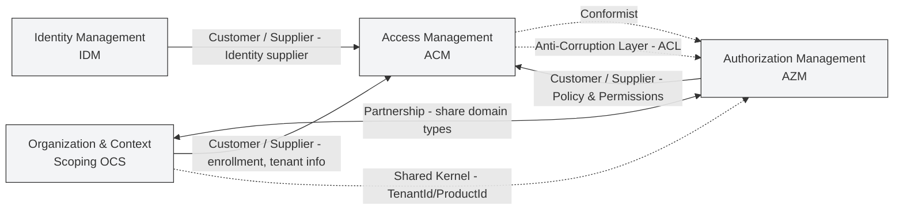

# Identity and Access Management (IAM) Domain Model

## 1. Ubiquitous Language (Ngôn ngữ chung)

Danh sách các thuật ngữ và định nghĩa được sử dụng trong mô hình miền IAM được trình bày chi tiết trong tài liệu [IAM Ubiquitous Language](/iam/iam-ul.md).

## 2. Sub Domains / Bounded Contexts

BC IAM được chia thành 4 Bounded Context:

### Identity Management (IDM)

Chịu trách nhiệm quản lý vòng đời định danh cá nhân của User.

**Boundaries:** là nguồn chân lý về user identity, enforce unique constraint qua Guard Streams ([ADR-IAM-7](./ADR-IAM-7.md)), emit revocation hint cho ACM khi đổi mật khẩu, takeover, xóa tài khoản.

**Yêu cầu chức năng:**

- **User Lifecycle:** Đăng ký, Cập nhật hồ sơ, Khóa/Mở khóa tài khoản.
- **Self-Service:** Người dùng tự đặt lại mật khẩu (SSPR) qua Email/OTP.
- **Credential Management:** Quản lý mật khẩu an toàn (Hashing).

**Aggregates Roots:**

- **`User AR`:** Đại diện cho một người dùng trong hệ thống.

[Tài liệu chi tiết về IDM Domain Model](./idm/idm-domain-model.md)
[Tài liệu chi tiết về IDM Use Cases](./idm/idm-use-cases.md.md)

### Access Management (ACM)

Chịu trách nhiệm xác thực người dùng và quản lý phiên truy cập.

**Boundaries:** là authority phát hành/thu hồi session, token, kiểm soát revocation, session versioning, token rotation ([ADR-IAM-2](./ADR-IAM-2.md), [ADR-IAM-10](./ADR-IAM-10.md)).

**Yêu cầu chức năng:**

- **Authentication:** Login (Password, Social, Passwordless), Logout.
- **Token Management:** Cấp phát Access Token (JWT), Refresh Token.
- **Session Control:** Quản lý phiên làm việc, hỗ trợ thu hồi (Revoke) phiên từ xa.
- **Security:** Hỗ trợ 2FA (TOTP), Adaptive Authenticate.

**Aggregates Roots:**

- **`Session AR`:** Đại diện cho một phiên đăng nhập, liên kết với User và Device.

**Revocation Orchestration (quyền và luồng xử lý):**

- Triggers cho việc thu hồi token có thể được phát sinh từ nhiều bounded context (ví dụ: AZM khi permissions/role thay đổi; IDM khi user bị suspend/locked/password change; OCS khi tenant/product/enrollment thay đổi; hoặc từ chính ACM khi phát hiện reuse/compromise).
- Tuy nhiên, ACM (Access Management / TokenService / SessionService) được xác định là authoritative owner cho hành động phát sự kiện thu hồi token/session (`AccessTokensRevokedEvent`, `SessionsRevokedEvent`). Các BC khác (AZM/IDM/OCS) sẽ phát các trigger-domain-events (ví dụ `RolePermissionsChangedEvent`, `UserAccountSuspendedEvent`, `TenantSuspendedEvent`) và có thể kèm "hints" token-level (ví dụ `affectedTokenReferenceHashes`, `affectedFids`) để hỗ trợ fast-path; nhưng chỉ ACM được quyền phát chính thức các event thu hồi và chịu trách nhiệm dedupe, audit và cập nhật revocation projections (Redis).

- Tài liệu này yêu cầu: mọi producer ngoài ACM không được phát `AccessTokensRevokedEvent` hay `SessionsRevokedEvent` trực tiếp trừ khi có chính sách ủy quyền rõ ràng và audit trail được bật. Thay vào đó, producers phải cung cấp đủ thông tin trong trigger event để ACM thực thi thu hồi theo chính sách (fast-path hoặc mapping-driven).

[Tài liệu chi tiết về ACM Domain Model](./acm/acm-domain-model.md)
[Tài liệu chi tiết về ACM Use Cases](./acm/acm-use-cases.md)

### Authorization Management (AZM)

Chịu trách nhiệm định nghĩa và thực thi các quy tắc phân quyền.

**Boundaries:** quản lý role/permission, permission registry, kiểm soát phân quyền động, RBAC/DRBAC ([ADR-IAM-4](./ADR-IAM-4.md)).

**Yêu cầu chức năng:**

- **Registry:** Đăng ký và quản lý danh mục Quyền (Permission) và Vai trò (Role).
- **Versioning:** Hỗ trợ phiên bản cho Permission để rollback khi cần.

**Aggregates Roots:**

**`Role AR`:** Định nghĩa tập hợp quyền. **Có phạm vi `product` hoặc `tenant` (product-scoped hoặc tenant-scoped)** — `Role` phải khai báo `scope` khi tạo. Khi một Product được cấu hình với `tenancyMode = Tenantless`, `Role` ở mức `tenant` không được phép; quy tắc này phải được thực thi bởi validator/command handler tại tầng AZM/OCS.

[Tài liệu chi tiết về AZM Domain Model](./azm/azm-domain-model.md)
[Tài liệu chi tiết về AZM Use Cases](./azm/azm-use-cases.md)

### Organization & Context Scoping (OCS)

Chịu trách nhiệm quản lý cấu trúc tổ chức, danh tính kỹ thuật product, tenant và ngữ cảnh truy cập. `User` được coi là một entity global (không scoped theo tenant). Tenancy được thực thi bằng cách ánh xạ (Enrollment) giữa `User` và `Tenant`/`Product` - OCS lưu giữ mapping này và chịu trách nhiệm cấp role/permission theo ngữ cảnh product/tenant.

**Boundaries:** quản lý mapping user vào tenant/product, là nền tảng cho context-based access, mọi session/token đều gắn với context do OCS quản lý.

**Yêu cầu chức năng:**

- **Product Management:** Tạo, sửa, khóa Sản phẩm (Product).
- **Tenant Management:** Tạo, sửa, khóa Tenant (Tổ chức).
- **Product Identity Management:** Quản lý danh tính kỹ thuật của Sản phẩm (Product), bao gồm trạng thái kích hoạt, chế độ tenancy (TenancyMode).
- **Enrollment:** Gán User vào Tenant/Product với các Role cụ thể.
- **Client Config:** Quản lý cấu hình OAuth Client (ClientId, Secret, RedirectURIs).

**Aggregates Roots:**

- **`Product AR`:** Quản lý danh tính kĩ thuật của một `Product`.
- **`Tenant AR`:** Đại diện cho đơn vị khách hàng/tổ chức trong mô hình tenancy.

[Tài liệu chi tiết về OCS Domain Model](./ocs/ocs-domain-model.md)
[Tài liệu chi tiết về OCS Use Cases](./ocs/ocs-use-cases.md)

### 3. Context Mapping

Sơ đồ dưới đây minh họa các bounded context và mối quan hệ giữa chúng, bao gồm các pattern DDD được áp dụng cho từng mối quan hệ:

