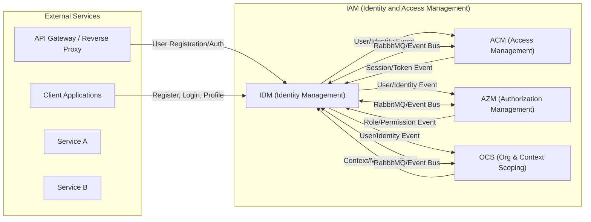
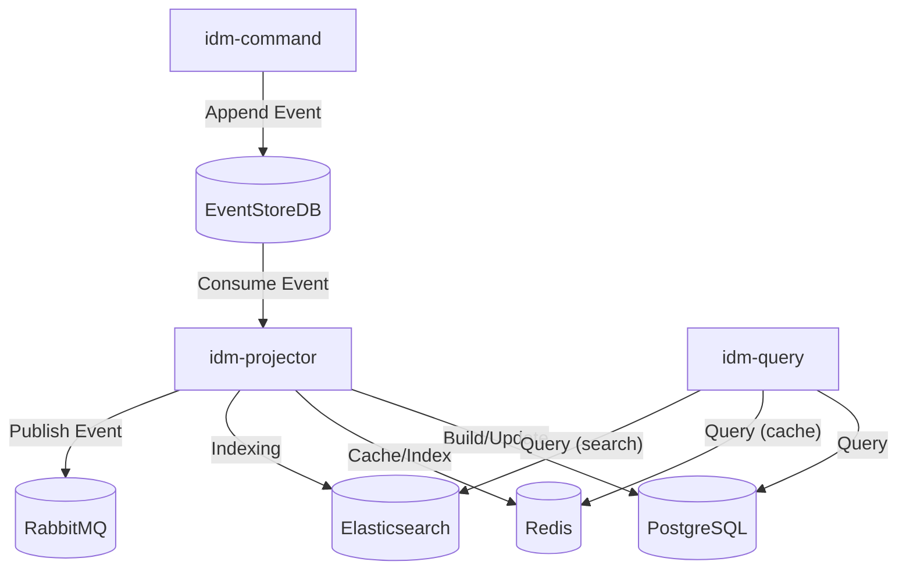

# Kiến trúc IDM (Identity Management)

## 1. Giới thiệu & Phạm vi

IDM (Identity Management) là sub-bounded context thuộc hệ IAM, chịu trách nhiệm quản lý vòng đời định danh người dùng: đăng ký, xác thực, cập nhật hồ sơ, quản lý mật khẩu, MFA, khóa/mở khóa, xóa tài khoản, và các thao tác liên quan đến email/username. IDM là nguồn chân lý (source of truth) về user identity, sử dụng event sourcing và đảm bảo các ràng buộc duy nhất (unique constraints) thông qua Guard Streams (Guard Stream keys are stored as hashed values for privacy, e.g. `unique-email-<hash(normalizedEmail)>`) và atomic write trên EventStoreDB.

## 2. Mục tiêu & Động lực

- Quản lý định danh tập trung, bảo mật, mở rộng.
- Đảm bảo các ràng buộc duy nhất (email, username) và atomicity khi thay đổi.
- Hỗ trợ các quy trình nghiệp vụ phức tạp: đăng ký, xác thực email, đổi email, reset mật khẩu, MFA, xóa tài khoản, takeover.
- Tích hợp chặt chẽ với các BC khác (ACM, OCS, AZM) qua event và read model.

## 3. Context Map

## 4. Các yêu cầu chức năng và phi chức năng

### 4.1. Yêu cầu chức năng

- [Register User Account](./idm-use-cases.md#register-user-account)
- [Verify Email](./idm-use-cases.md#verify-email)
- [Update User Profile](./idm-use-cases.md#update-user-profile)
- [Change User Password](./idm-use-cases.md#change-user-password)
- [Manage MFA (TOTP)](./idm-use-cases.md#manage-mfa-totp)
- [Lock / Unlock User Account](./idm-use-cases.md#lock--unlock-user-account)
- [Delete User Account](./idm-use-cases.md#delete-user-account)
- [Change Email (Initiate / Confirm / Cancel)](./idm-use-cases.md#change-email-initiate--confirm--cancel)
- [Password Reset (SSPR)](./idm-use-cases.md#password-reset-sspr)
- [Change Username](./idm-use-cases.md#change-username)
- [Disable MFA](./idm-use-cases.md#disable-mfa)
- [Atomic Takeover (Competing Claim)](./idm-use-cases.md#atomic-takeover-competing-claim)

### 4.2. Yêu cầu phi chức năng

**Yêu cầu phi chức năng (SLO/SLI):**

- **SLO về tính sẵn sàng:** Đảm bảo 99,95% thời gian hoạt động hàng tháng cho API đăng ký và xác thực người dùng.
- **SLI về độ trễ:** 95% các yêu cầu xác thực/đăng ký hoàn thành trong vòng 150ms. _(Đo từ lúc server nhận request đến khi gửi response, chỉ tính thời gian phía server, không bao gồm thời gian mạng của client.)_
- **SLI về tính nhất quán:** 99% thay đổi định danh (hồ sơ, mật khẩu, MFA) được phản ánh lên projection trong vòng 2 giây.
- **SLO về bảo mật:** 100% mật khẩu được băm bằng Argon2id và không lưu trữ secret thô trong event/projection.
- **SLO về khả năng mở rộng:** Hỗ trợ tối thiểu 500 thao tác đăng ký/xác thực đồng thời với tỷ lệ lỗi < 1%.
- **SLO về khả năng kiểm toán:** 100% sự kiện vòng đời định danh được ghi log và truy vết đầy đủ.

## 5. Sơ đồ triển khai

## 6. Cấu trúc project

- `domains/idm-domain` : Mô tả các entity, value object, aggregate root và domain events thuộc IDM. Đây là lõi business/domain logic độc lập với framework.
- `interactors/idm-command-interactor` : Use-cases và trình xử lý command (đăng ký, đổi mật khẩu, quản lý MFA, takeover, v.v.). Chịu trách nhiệm orchestration business, validation, và quyết định append event vào EventStore.
- `interactors/idm-query-interactor` : Use-cases cho read-model queries, mapping giữa read model và các request nghiệp vụ phức tạp, đảm bảo invariant khi truy vấn cần logic hơn là simple SQL.
- `interactors/idm-projector-interactor` : (recommended) Tập trung logic projection: chuyển event -> cập nhật read model, quyết định checkpoint/snapshot theo ADRs, xử lý idempotency/dedupe, merge policy cho permissions, và enrich/audit provenance. Adapter sẽ chịu phần I/O (transaction, persist checkpoint), còn interactor chứa business rules của projector.
- `adapters/idm-command-adapter` : Kết nối hạ tầng cho command side (HTTP controllers, gRPC, EventStore append helpers, Guard Stream helpers, hashing utilities).
- `adapters/idm-query-adapter` : Kết nối hạ tầng cho query side (Postgres clients, Redis cache clients, Elasticsearch client, API layer).
- `adapters/idm-projector-adapter` : Subscription / lifecycle management cho projection (EventStore subscription, transaction boundary, checkpoint persistence, DLQ/retry). Adapter gọi `interactors/idm-projector-interactor` để thực hiện transform logic.
- `adapters/idm-shared-adapter` : Thư viện dùng chung (serializers, event envelope types, security helpers như hashing, common validators).
- `apps/idm-command` : Entrypoint/service cho command side — wiring, configuration, health checks, metrics.
- `apps/idm-query` : Entrypoint/service cho query side — read-only APIs, caching layers, search endpoints.
- `apps/idm-projector` : Entrypoint/service cho projector process — chạy subscriptions, xử lý stream và forward side-effects (publish events to RabbitMQ).

## 7. Các tài liệu tham khảo

- [IDM Domain Model](./idm-domain-model.md)
- [IDM Use Cases](./idm-use-cases.md)
- [IDM Roadmap](./idm-roadmap.md)
