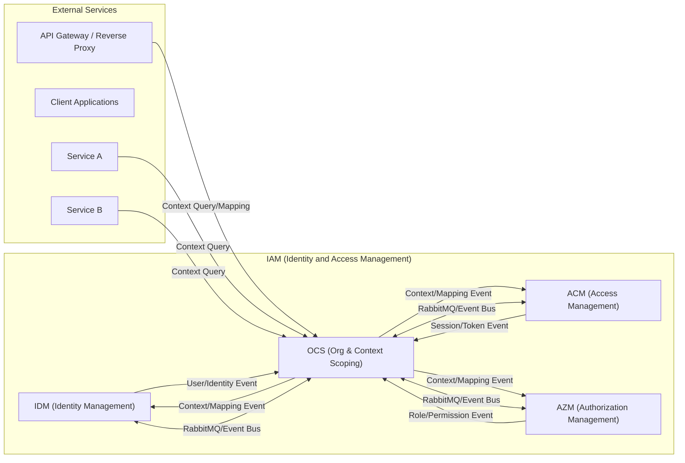
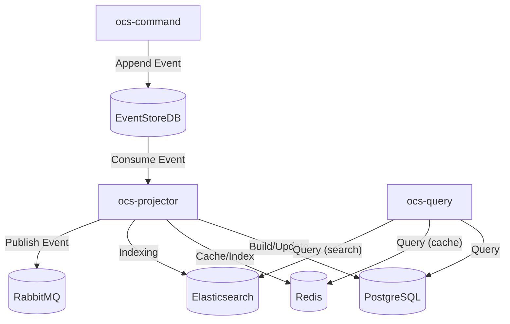

# Kiến trúc OCS (Organization & Context Scoping)

## 1. Giới thiệu & Phạm vi

OCS là sub-bounded context thuộc hệ IAM, chịu trách nhiệm quản lý tổ chức (tenant), sản phẩm (product), và membership (thành viên, vai trò trong từng tenant/product). OCS cung cấp nền tảng cho mô hình đa tenant, đa sản phẩm, và phân tách ngữ cảnh truy cập cho các BC khác.

## 2. Mục tiêu & Động lực

- Quản lý cấu trúc tổ chức, sản phẩm, membership một cách linh hoạt, mở rộng.
- Hỗ trợ các mô hình tenancy phức tạp (user thuộc nhiều tenant, nhiều product, vai trò độc lập theo từng context).
- Làm nền tảng cho phân quyền, kiểm soát truy cập theo ngữ cảnh.

## 3. Context Map

## 4. Các yêu cầu chức năng và phi chức năng

### 4.1. Yêu cầu chức năng

- [Create Tenant](./ocs-use-cases.md#create-tenant)
- [Update Tenant](./ocs-use-cases.md#update-tenant)
- [Suspend / Activate Tenant](./ocs-use-cases.md#suspend--activate-tenant)
- [Delete Tenant (Soft-delete) with Atomic Name Release](./ocs-use-cases.md#delete-tenant-soft-delete-with-atomic-name-release)
- [Register Product](./ocs-use-cases.md#register-product)
- [Update / Deactivate Product](./ocs-use-cases.md#update--deactivate-product)
- [Tenant Product Enrollment](./ocs-use-cases.md#tenant--product-enrollment-tenantproductenrollment)
- [Assign / Revoke Membership](./ocs-use-cases.md#membership-assign--revoke-role-in-producttenant)
- [Guard Streams for Uniqueness](./ocs-use-cases.md#guard-streams-and-uniqueness-semantics-guidance)
- [Emit Trigger Events and Revocation Hints](./ocs-use-cases.md#integration-contracts-ocs--acm--azm-triggers--hints)
- [Read-Your-Own-Writes Guidance for OCS](./ocs-use-cases.md#read-your-own-writes-ryow-guidance)

### 4.2. Yêu cầu phi chức năng

**Yêu cầu phi chức năng (SLO/SLI):**

- **SLO về tính sẵn sàng:** Đảm bảo 99,95% thời gian hoạt động hàng tháng cho API quản lý tenant/product/membership.
- **SLI về độ trễ:** 95% các yêu cầu đọc membership/tenant/product hoàn thành trong vòng 150ms. _(Đo từ lúc server nhận request đến khi gửi response, chỉ tính thời gian phía server, không bao gồm thời gian mạng của client.)_
- **SLI về tính nhất quán:** 99% thay đổi membership/tenant/product được phản ánh lên projection trong vòng 2 giây.
- **SLO về bảo mật:** 100% thay đổi membership/tenant/product đều có thể kiểm toán và không lưu trữ secret thô trong event/projection.
- **SLO về khả năng mở rộng:** Hỗ trợ tối thiểu 200 thao tác membership/tenant/product đồng thời với tỷ lệ lỗi < 1%.
- **SLO về khả năng kiểm toán:** 100% sự kiện vòng đời membership/tenant/product được ghi log và truy vết đầy đủ.

## 5. Sơ đồ triển khai

## 6. Các tài liệu tham khảo

- [OCS Domain Model](./ocs-domain-model.md)
- [OCS Use Cases](./ocs-use-cases.md)
- [OCS Roadmap](./ocs-roadmap.md)
