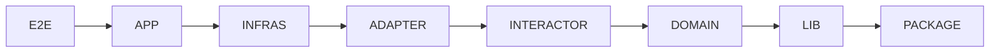

# **Clean Domain Driven Development Monorepo Architecture (C4 Architecture)**

## 1. Tầm quan trọng của Việc Thiết kế Tập trung vào Nghiệp vụ

1. **Tại sao cần thiết kế kiến trúc?**
   - **Hạn chế nợ kỹ thuật (Technical Debt):** Kiến trúc rõ ràng giúp phân tách các thành phần, ngăn chặn sự chồng chéo và phụ thuộc phức tạp, từ đó giảm chi phí bảo trì và mở rộng về lâu dài.
   - **Tăng khả năng bảo trì và phát triển bền vững:** Mặc dù giai đoạn đầu có thể chậm hơn so với cách tiếp cận thông thường, kiến trúc tốt đảm bảo việc bổ sung tính năng mới hoặc thay đổi nghiệp vụ cốt lõi (Core Domain) diễn ra an toàn, nhanh chóng và ít rủi ro hơn.
   - **Đảm bảo khả năng kiểm thử (Testability):** Việc tách biệt logic nghiệp vụ khỏi cơ sở dữ liệu và giao diện giúp chúng ta kiểm thử các quy tắc cốt lõi một cách độc lập và hiệu quả.
2. **DDD (Thiết kế hướng Tên miền) là gì?**
   - DDD là một triết lý thiết kế phần mềm, tập trung vào việc mô hình hóa phần mềm để khớp với nghiệp vụ cốt lõi (Core Domain) phức tạp của tổ chức.
   - Nó cung cấp các công cụ **chiến lược** (để phân tích vấn đề) và **chiến thuật** (để xây dựng mô hình code).
3. **Clean Architecture (Kiến trúc Sạch) là gì?**
   - CA, phổ biến bởi Robert C. Martin (Uncle Bob), là một kiến trúc tập trung vào nguyên tắc **Tách biệt trách nhiệm (Separation of Concerns)**, giúp hệ thống không bị ràng buộc bởi các chi tiết bên ngoài như cơ sở dữ liệu hoặc framework web.
   - **Nguyên tắc Phụ thuộc (Dependency Rule):** Đây là nguyên tắc cốt lõi, quy định rằng các phụ thuộc (Dependencies) trong mã nguồn chỉ được phép trỏ từ các lớp bên ngoài (Infrastructure) vào các lớp bên trong (Domain).
4. **Sự kết hợp hoàn hảo:**
   - **DDD** cung cấp **Cái gì** (Mô hình Nghiệp vụ chính xác: Entity, Aggregate, Value Object).
   - **CA** cung cấp **Làm thế nào** (Cấu trúc và quy tắc phân tách để bảo vệ mô hình nghiệp vụ đó khỏi các chi tiết kỹ thuật).

## 2. Domain Driven Design (DDD)

DDD giúp chúng ta định hình rõ ràng ranh giới và xây dựng các khối mã nguồn phản ánh chính xác nghiệp vụ.

### 2.1. Thiết kế Chiến lược (Strategic Design) – Hiểu Vấn đề

1. **Tên miền (Domain), Tên miền con (Subdomain) và Tên miền cốt lõi (Core Domain)**
   - **Domain:** Lĩnh vực mà ứng dụng của bạn hoạt động (ví dụ: Thương mại điện tử).
   - **Subdomain (Tên miền con):** Các phần riêng biệt trong Domain (ví dụ: Quản lý Kho hàng, Xử lý Thanh toán, Vận chuyển).
   - **Core Domain (Tên miền cốt lõi):** Các Subdomain mang lại lợi thế cạnh tranh cốt lõi cho doanh nghiệp. Đây là nơi cần đầu tư áp dụng DDD nhiều nhất.
2. **Ngôn ngữ Phổ quát (Ubiquitous Language - UL)**
   - **Vai trò:** Là bộ thuật ngữ thống nhất, được sử dụng đồng bộ bởi các Chuyên gia Nghiệp vụ (Domain Expert) và Nhà phát triển (Developer).
   - **Quy tắc:** Mọi thuật ngữ trong UL phải được phản ánh trực tiếp trong tên Class, Method và Variable trong mã nguồn.
3. **Ngữ cảnh Giới hạn (Bounded Context - BC)**
   - **Định nghĩa:** Ranh giới logic nơi Ngôn ngữ Phổ quát (UL) có ý nghĩa và tính nhất quán. Một thuật ngữ có thể có nghĩa khác nhau trong các BC khác nhau (ví dụ: "Sản phẩm" trong BC Bán hàng khác với "Sản phẩm" trong BC Quản lý Kho).
   - **Tầm quan trọng:** BC là đơn vị tổ chức mã nguồn, đóng gói mô hình nghiệp vụ và thường tương ứng với một Microservice hoặc một Module độc lập trong hệ thống.
4. **Ánh xạ Ngữ cảnh (Context Mapping)**
   - **Mục đích:** Định nghĩa mối quan hệ và sự tương tác giữa các BC.
   - **Anti-Corruption Layer (ACL):**
     - Đây là một lớp dịch thuật (Translation Layer) **bắt buộc** phải có khi BC của bạn giao tiếp với một hệ thống bên ngoài hoặc hệ thống cũ (Legacy/Foreign System) mà bạn không kiểm soát được.
     - ACL đảm bảo mô hình Domain sạch của bạn không bị "ô nhiễm" bởi các khái niệm/cấu trúc dữ liệu không phù hợp từ hệ thống bên ngoài.

### 2.2. Thiết kế Chiến thuật (Tactical Design) – Xây dựng Mô hình

1. **Entity (Thực thể) và Value Object (Đối tượng Giá trị)**
   - **Entity:** Có định danh (ID) và trạng thái có thể thay đổi trong suốt vòng đời. Ví dụ: Customer (Khách hàng), Order (Đơn hàng).
   - **Value Object (VO):** Không có định danh riêng, được định nghĩa bằng các thuộc tính của nó, và là **bất biến (Immutable)**. VO được dùng để mô hình hóa các khái niệm như tiền tệ (Money), địa chỉ (Address), hoặc phạm vi ngày (DateRange).
   - _Mẹo áp dụng:_ Ưu tiên sử dụng VO tối đa để đạt được tính bất biến và tăng cường tính rõ ràng cho nghiệp vụ.
2. **Aggregate (Tổng hợp)**
   - **Aggregate Root (AR):** Thực thể duy nhất đại diện cho Aggregate. Mọi thao tác truy cập và thay đổi bên ngoài đều **phải** thông qua AR.
   - **Quy tắc Bất biến (Invariants):** AR phải đảm bảo tính nhất quán (Invariants) của tất cả các Entity và VO bên trong Aggregate của nó (ví dụ: Tổng giá trị đơn hàng phải luôn bằng tổng giá trị các mặt hàng).
   - _Quy tắc thiết kế:_ Giữ cho Aggregate nhỏ và chỉ bao gồm các thành phần **thực sự cần thiết** để duy trì tính nhất quán giao dịch (transactional consistency).
3. **Repository (Kho lưu trữ)**
   - **Mục đích:** Là cầu nối giữa Domain và cơ sở hạ tầng (Persistence). Nó trừu tượng hóa chi tiết lưu trữ dữ liệu.
   - **Quy tắc:** Repository chỉ được tạo cho **Aggregate Root**. Nó có nhiệm vụ tải toàn bộ AR và lưu toàn bộ AR.
4. **Domain Service (Dịch vụ Tên miền) và Domain Event (Sự kiện Tên miền)**
   - **Domain Service:** Dành cho logic nghiệp vụ:
     - Không thuộc về một Entity hay Aggregate cụ thể nào.
     - Cần tương tác với nhiều Aggregate khác nhau (ví dụ: Chuyển tiền giữa hai tài khoản).
   - **Domain Event:** Ghi lại những điều quan trọng đã xảy ra trong Domain (ví dụ: OrderCreated, CustomerNameChanged). Chúng được dùng để giao tiếp không đồng bộ giữa các Aggregate hoặc Bounded Context.

## 3. Clean Architecture (CA)

DDD cung cấp một tư tưởng còn CA cung cấp các nguyên tắc về cấu trúc chung của một dự án hướng nghiệp vụ giúp hệ thống sống sót qua các thay đổi kỹ thuật.

### 3.1. Nguyên tắc Cốt lõi

**3.1.1. Quy tắc Phụ thuộc (Dependency Rule)**

- Quy tắc này rất nghiêm ngặt: Code bên trong **không bao giờ** được biết hoặc tham chiếu đến code bên ngoài.
- Mũi tên phụ thuộc luôn hướng vào Core Domain (các lớp Domain bên trong). Điều này được thực hiện thông qua Dependency Inversion Principle (DIP).  
  **3.1.2. Các Vòng tròn (Layers) của CA:**
- **Domain Entities:** Lớp trong cùng, chứa các quy tắc nghiệp vụ cốt lõi (Aggregate, Entity, VO).
- **Application Business Rules (Use Cases):** Lớp chứa logic điều phối và các quy tắc nghiệp vụ ứng dụng (Application Logic).
- **Interface Adapters:** Lớp chuyển đổi dữ liệu từ bên ngoài (UI/DB) sang định dạng phù hợp với các lớp bên trong, và ngược lại.
- **Frameworks & Drivers:** Lớp ngoài cùng, chứa các chi tiết kỹ thuật (Web Framework, DB, UI).

### 3.2. Chi tiết các Lớp (Layers) và Trách nhiệm

**3.2.1. Lớp Domain (Core):**

- **Nội dung:** DDD Entities, Value Objects, Domain Services, và quan trọng nhất là các **Repository Interfaces** (vì Repository là một khái niệm nghiệp vụ).
- **Trách nhiệm:** Thực thi các quy tắc nghiệp vụ quan trọng nhất. Đây là trái tim của ứng dụng. Lớp này không được có bất kỳ sự phụ thuộc (import) nào vào lớp ngoài (Infrastructure, Presentation).  
  **3.2.2. Lớp Application (Ứng dụng):**
- **Nội dung:**
  - **Use Cases (Interactors):** Định nghĩa tất cả các tính năng có thể có của ứng dụng (ví dụ: CreateOrderUseCase, GetCustomerDetailsQuery).
  - **Data Transfer Objects (DTOs):** Các đối tượng Input/Output được định nghĩa riêng cho Use Case, dùng để truyền dữ liệu giữa các lớp.
- **Trách nhiệm:** Điều phối luồng dữ liệu (Flow) giữa lớp Presentation và lớp Domain, và quản lý các giao dịch (Transactions).  
  **3.2.3. Lớp Infrastructure (Cơ sở hạ tầng):**
- **Nội dung:**
  - Triển khai (Implementation) của các Repository Interfaces (ví dụ: SqlOrderRepository).
  - DB Context/ORM Mappers, API Clients, Logging, Emailing.
- **Trách nhiệm:** Xử lý các chi tiết kỹ thuật. Lớp này **phụ thuộc** vào Lớp Domain (thông qua Interface) nhưng Lớp Domain không biết đến sự tồn tại của nó.  
  **3.2.4. Lớp Presentation (Trình bày):**
- **Nội dung:** API Controllers (REST/GraphQL), Web UI, Command Line Interface (CLI).
- **Trách nhiệm:**
  - Tiếp nhận yêu cầu từ người dùng (HTTP Request).
  - Chuyển đổi dữ liệu thô sang Input DTO.
  - Gọi Use Case thích hợp trong Lớp Application.
  - Chuyển đổi Output DTO thành Response (JSON/HTML) và gửi lại cho người dùng.

## 4. Monorepo

Monorepo là một cách tiếp cận mạnh mẽ để quản lý nhiều Bounded Contexts (BCs) và Microservices trong một không gian làm việc thống nhất.

### 4.1 Định nghĩa và Đặc điểm:

- Monorepo là một chiến lược quản lý mã nguồn, trong đó code cho nhiều dự án hoặc ứng dụng độc lập được lưu trữ trong một kho chứa (repository) duy nhất.
- Khác với Monolith (một ứng dụng lớn), Monorepo chứa nhiều project nhỏ (có thể là Microservices/Thư viện hoặc Bounded Contexts) được triển khai độc lập.

### 4.2 Lợi ích Kỹ thuật Cốt lõi:

- Quản lý Phụ thuộc Đơn giản: Dễ dàng chia sẻ các thư viện kỹ thuật (Logging, Utils) và DTO/Interfaces giữa các dự án mà không cần quản lý phiên bản (versioning) phức tạp như trong Multirepo.
- Quy trình CI/CD Thống nhất: Chỉ cần một cấu hình CI/CD duy nhất cho toàn bộ tổ chức, giảm thiểu chi phí thiết lập và bảo trì.
- Tăng cường Tính nhất quán: Đảm bảo tất cả các dự án tuân thủ cùng một tiêu chuẩn mã nguồn, quy tắc linting và kiểm thử.
- Tăng cường Hợp tác: Các nhóm phát triển có thể dễ dàng chia sẻ kiến thức và phối hợp làm việc trên cùng một kho mã nguồn.

## 5. Clean Domain Driven Development Monorepo Architecture (C4 Architecture)

Nếu DDD cung cấp một tư tưởng và CA cung cấp các nguyên tắc về cấu trúc chung, Monorepo cung cấp một các tiếp cận để quản lý codebase thì **C4 Architecture** cũng cấp một bộ các nguyên tắc sâu hơn về chi tiết cấu trúc một monorepo hướng tới phát triển hướng nghiệp vụ theo DDD và CA.

### 5.1. Các nguyên tắc cốt lõi của C4 Architecture

C4A kế thừa tư tưởng DDD và nguyên tắc vòng tròn của Clean Architecture, nhưng mở rộng và đặt tên cụ thể cho các khu vực thường thấy trong một monorepo hướng domain. Mục tiêu của phần này là làm rõ:

**Phân chia layer**

Ở mức cao, C4A phân chia repository thành các khu vực sau (từ ngoài vào trong, tức là theo chiều phụ thuộc cho phép):

- `e2e` — End-to-end tests: dự án/điểm tập trung các bài kiểm thử xuyên hệ thống, chỉ dùng giao diện công khai của `app`.
- `app` — Application / Presentation: API, UI hoặc các entrypoint (services, apps) chịu trách nhiệm nhận yêu cầu và phối hợp các thành phần bên trong để trả lời.
- `infras` — Infra / Environment: mô tả các cấu hình môi trường, adapters cho các dịch vụ bên ngoài ở mức kỹ thuật (ví dụ: kết nối đến hệ thống bên ngoài, config môi trường, infra contracts). Ở phạm vi tài liệu này, `infras` biểu diễn ranh giới kỹ thuật chung của monorepo.
- `adapter` — Interface Adapters: lớp chuyển đổi giữa các dạng dữ liệu bên ngoài (HTTP, MQ, DB rows) và các DTO/VO/Entity của `interactor`/`domain`.
- `interactor` — Application Use Cases / Orchestrators: các use case, application services, coordination logic dùng để thực thi nghiệp vụ phối hợp giữa nhiều aggregate hoặc repository.
- `domain` — Core Domain: mô hình nghiệp vụ thuần tụy (Entities, Aggregates, Value Objects, Domain Services, Repository interfaces). Đây là trái tim của hệ thống.
- `lib` — Internal libraries: các thư viện dùng chung nằm trong mono-repo và phục vụ nhiều domain (ví dụ: helper chung, các hàm tiện ích không thuộc domain, các kiểu dữ liệu chung nhưng không publish ra ngoài).
- `package` — Public packages / SDKs: các package được thiết kế để publish hoặc chia sẻ ra ngoài repository (với API ổn định hơn). Chúng là nền tảng nhất, nên có độ ổn định và backward-compatibility cao hơn (Có thể là publish nội bộ hoặc công khai)

Cố định tên gọi các layer như trên giúp tạo sự thống nhất trong toàn tổ chức, làm rõ ràng vai trò và trách nhiệm của từng khu vực trong monorepo. Danh sách các tầng này sẽ được tổ chức thành các thư mục trong root của repository:

```/
  ├── apps/
  ├── domains/
  ├── adapters/
  ├── interactors/
  ├── libs/
  ├── packages/
  └── e2e/
  └── infras/
```

**Quy tắc phụ thuộc**
Quy tắc phụ thuộc (Dependency Rule) trong C4A:

- mọi phụ thuộc được phép phải chỉ hướng từ trái sang phải theo thứ tự trên (outer -> inner). Nói cách khác, một mô-đun trong `app` có thể phụ thuộc vào `infras` hoặc bất kỳ tầng nào đứng về phía phải của nó, nhưng không được phụ thuộc vào tầng nằm ngoài nó về phía trái.
- Trong một tầng có thể được phụ thuộc vào nhau. Riêng `domain` thì không được phép phụ thuộc lẫn nhau ngoài trừ `shared-kernel`.
- Không được phép phụ thuộc vòng (circular dependency).

Lý do và nguyên tắc cho thứ tự này:

- Các tầng bên ngoài (ví dụ `e2e`, `app`) là những thành phần sử dụng hoặc tổ chức hệ thống — chúng nên phụ thuộc vào những thành phần bên trong để thực thi nghiệp vụ.
- `infras` và `adapter` nằm giữa chừng vì chúng đại diện cho các chi tiết triển khai và việc chuyển đổi dữ liệu; chúng cần tham chiếu tới các use-case hoặc domain để biết cách map dữ liệu, nhưng domain thì không nên biết về chi tiết này.
- `interactor` phụ thuộc vào `domain` vì use-case điều phối và sử dụng các khái niệm nghiệp vụ. `domain` duy trì tính thuần khiết, hạn chế phụ thuộc vào các phần không thuần nghiệp vụ.
- `lib` và `package` ở phía trong (được coi là nền tảng): `package` đại diện cho các thư viện ổn định/public, `lib` là các tiện ích nội bộ; đặt chúng là nền tảng giúp tránh tái hiện các hàm cơ bản nhiều lần và giúp đảm bảo tính ổn định.

> Thứ tự trên là nguyên tắc thiết kế — tổ chức cụ thể của một repository có thể điều chỉnh (ví dụ tách thêm tầng con) nhưng mọi thay đổi phải tuân theo nguyên tắc căn bản: phụ thuộc chỉ chảy một chiều hướng vào lõi nghiệp vụ.

**Quy tắc quản trị thay đổi**

- Thay đổi càng vào tâm càng phải thận trọng hơn vì mức độ ảnh hưởng sẽ càng lớn hơn do nguyên tắc phụ thuộc một chiều.
- Thay đổi trong `package`, `lib` cần có kế hoạch tương thích ngược (backward compatibility) và lịch deprecation rõ ràng. Để dễ dàng tạo patch vá và hỗ trợ các thành phần liên quan trong các layer ở vòng ngoài được cập nhật dần dần. Phải review thật ký lưỡng đánh giá tác động một cách chi tiết trước khi thực hiện thay đổi. Áp dụng nguyên tắc Ba lần Lặp lại (The Rule of Three) để xác định chức năng cần thiết cho `lib` và `package`.
- Các dự án trong `package` tuyệt đối không được chứa các logic nghiệp vụ (business logic) nào, vì chúng là các package/public SDK dùng chung cho nhiều dự án khác nhau.

**Kiểm thử**

- Bắt buộc phải triển khai unit test cho mọi tầng trong c4a. Điều này sẽ giúp đảm bảo rằng các thay đổi trong một tầng không vô tình phá vỡ chức năng trong các tầng khác, đặc biệt là khi các tầng phụ thuộc vào nhau theo quy tắc đã định.
- Integration test phải được triển khai cho tầng `adapter`
- E2E test là một mục tiêu bắt buộc cho toàn bộ hệ thống, được tổ chức trong thư mục `e2e`.

### 5.2. Sơ đồ Minh họa C4 Architecture


