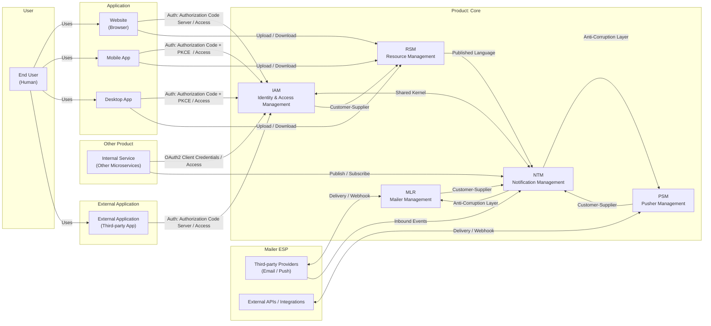

# Tổng quan Kiến trúc Hệ thống

Tài liệu này mô tả kiến trúc cấp cao (High-Level Architecture) và các quy tắc phụ thuộc cốt lõi mà tất cả các dự án trong Monorepo này phải tuân thủ. Nó đóng vai trò là "Hiến pháp" kỹ thuật, đảm bảo tính nhất quán, khả năng mở rộng và tối ưu hóa chi phí cho toàn bộ tổ chức.

## 1 Mục tiêu và Động lực

Hệ thống được xây dựng theo mô hình **Centralized Platform** (Nền tảng tập trung), cung cấp các dịch vụ và hạ tầng dùng chung cho toàn bộ tổ chức. Mục tiêu không chỉ dừng lại ở việc quản lý định danh (IAM) mà mở rộng sang quản lý Tài nguyên, Giao tiếp và Hạ tầng cốt lõi.

Động lực chính của kiến trúc này bao gồm:

- **Lợi thế Kinh tế (Economy of Scale):**
  - **Chi phí Tài nguyên:** Tập trung hóa việc mua sắm dịch vụ bên thứ 3 (Email, SMS Brandname, Cloud Storage) để đạt được mức giá sỉ tốt hơn.
  - **Chi phí Hạ tầng:** Thay vì mỗi dự án chạy riêng lẻ một cụm Database/K8s (tốn kém tài nguyên dự phòng), toàn bộ hệ thống sử dụng các **Shared Clusters** lớn, tối ưu hóa hiệu suất sử dụng phần cứng.
- **Tối ưu Vận hành (Shared Operations):** Đội ngũ Platform Engineering/DevOps tập trung quản lý và giám sát các cụm hạ tầng chung. Các team sản phẩm (Product Teams) được giải phóng khỏi gánh nặng vận hành DB/Infra để tập trung hoàn toàn vào nghiệp vụ.
- **Tăng tốc độ phát triển (Time-to-market):** Cung cấp sẵn các khối xây dựng (Building Blocks) như Auth, Upload, Notification. Dev chỉ cần tích hợp, không cần xây dựng lại (Don't Reinvent the Wheel).
- **Bảo mật Nhất quán:** Áp dụng chính sách bảo mật tập trung tại Gateway và IAM, giảm thiểu rủi ro sai sót cấu hình phân tán.

## 2. Ghi chép Quyết định Kiến trúc chung

**[ADR-G1: Chiến lược Monorepo với Nx và DevContainers](./ADR-G1.md)**: Chọn Monorepo + Nx + DevContainer để tối ưu tốc độ build, caching và chuẩn hóa môi trường phát triển.

**[ADR-G2: Containerization & Kubernetes](./ADR-G2.md)**: Đóng gói bằng Docker và vận hành production trên Kubernetes để orchestration, auto-scaling và self-healing.

**[ADR-G3: Hạ tầng Nền tảng Chia sẻ (Shared Platform Infrastructure)](./ADR-G3.md)**: Cung cấp hạ tầng dùng chung nhưng tách biệt dữ liệu theo service để giảm chi phí và tập trung vận hành.

**[ADR-G4: Bảo mật S2S (Service-to-Service)](./ADR-G4.md)**: Sử dụng OAuth2 Client Credentials (S2S Tokens) cho xác thực nội bộ thay vì mTLS để giảm phức tạp vận hành.

**[ADR-G5: EventStoreDB thay vì PostgreSQL cho Event Sourcing](./ADR-G5.md)**: Dùng EventStoreDB làm event store chính để tận dụng streams, projections, snapshot và hiệu năng append-only.

**[ADR-G6: Áp dụng CQRS (Command Query Responsibility Segregation)](./ADR-G6.md)**: Áp dụng CQRS cho các bounded context cần tách biệt read/write và dùng Event Sourcing cho AR cần audit/rehydration.

**[ADR-G7: Áp dụng Event-Driven Architecture (EDA)](./ADR-G7.md)**: Ưu tiên EDA với RabbitMQ, event versioning và DLQ/retry nhằm giao tiếp bất đồng bộ, bền bỉ và tách rời.

**[ADR-G8: Áp dụng Behavior Driven Development (BDD)](./ADR-G8.md)**: Áp dụng BDD (Gherkin + Cucumber) làm phương pháp chính để tăng hợp tác và cải thiện chất lượng kiểm thử.

**[ADR-G9: Lựa chọn NestJS với TypeScript cho Backend](./ADR-G9.md)**: Chọn NestJS + TypeScript làm framework backend chính vì module hóa, DI mạnh và hệ sinh thái phong phú.

**[ADR-G10: Sử dụng UUID v7 cho toàn hệ thống](./ADR-G10.md)**: Chuẩn hóa UUID v7 cho ID hệ thống để có khả năng sắp xếp theo thời gian và hỗ trợ sinh ID offline.

### 2. Các Nguyên tắc Thiết kế Chính (Architectural Principles)

Kiến trúc của repo này tuần thủ theo **[C4A](c4a.md)** (Sự kế thừa từ Domain-Driven Design, Clean Architect và Monorepo với các quy tắc chi tiết hơn). **C4A là nền tảng cho kiến trúc của toàn bộ dự án này**

Mọi dịch vụ trong hệ thống phải tuân thủ các nguyên tắc sau:

- **Domain Driven Development/Clean Architecture/Monorepo**: Tuân thủ nghiêm ngặt các nguyên tắc DDD và Clean Architecture như đã mô tả trong [C4A](c4a.md). Sử dụng monorepo với Nx để quản lý mã nguồn hiệu quả. [Xem chi tiết](c4a.md)
- **CQRS (Command Query Responsibility Segregation):** Bắt buộc áp dụng cho bất kỳ dịch vụ nào có sự chênh lệch tải Đọc/Ghi hoặc logic phức tạp. [Xem chi tiết](./adr/ADR-G6.md)
- **Event-Driven Architecture (EDA):** Giao tiếp mặc định là bất đồng bộ qua Message Broker để đảm bảo tính liên kết lỏng (Loosely Coupled). [Xem chi tiết](./adr/ADR-G7.md)
- **Behavior Driven Development (BDD):** Áp dụng BDD để đảm bảo sự hợp tác giữa các bên liên quan và cải thiện chất lượng phần mềm thông qua kiểm thử dựa trên hành vi. [Xem chi tiết](./adr/ADR-G8.md)
- **Event Sourcing (ES) - Optional:** Cân nhắc sử dụng cho các Aggregate Root cần auditability hoặc khả năng tái tạo trạng thái (Rehydration) và sử dụng Event Store Database để lưu trữ sự kiện. [Xem chi tiết](./adr/ADR-G5.md)

## 2. Lựa chọn Công nghệ và Giải trình Kiến trúc

### 2.1. Stack Công nghệ Cốt lõi

| Lớp (Layer)            | Công nghệ                            | Ghi chú                                                                                |
| :--------------------- | :----------------------------------- | :------------------------------------------------------------------------------------- |
| **Language/Framework** | TypeScript/NestJS                    | Framework chính, hỗ trợ Dependency Injection và Module hóa mạnh mẽ.                    |
| **Database**           | Event Store DB/ PostgreSQL / MongoDB | EventStoreDB cho Event Sourcing; PostgreSQL cho relational data; MongoDB cho tài liệu. |
| **Cache**              | Redis                                | Bộ nhớ đệm in-memory hiệu suất cao,                                                    |
| **Message Broker**     | RabbitMQ                             | Xương sống cho giao tiếp Event-Driven.                                                 |
| **Search Engine**      | Elasticsearch                        | Công cụ tìm kiếm mạnh mẽ, hỗ trợ phân tích và truy vấn dữ liệu nhanh chóng.            |
| **Observability**      | OpenTelemetry (W3C Propagation)      | Chuẩn mở cho tracing, metrics và logging.                                              |

### 2.2. Chiến lược Hạ tầng Chia sẻ (Shared Infrastructure Strategy)

Để giải quyết bài toán kinh tế, các thành phần sau được triển khai dưới dạng **Multi-tenant Clusters**:

1.  **Centralized Databases (PostgreSQL, MongoDB, EventStoreDB):**
    - Được triển khai thành các cụm (Cluster) lớn, có HA (High Availability).
    - Các dịch vụ (Microservices) sử dụng chung cụm vật lý nhưng phân tách logic bằng `Database Name` hoặc `Schema`.
    - **Lợi ích:** Giảm chi phí license, giảm overhead quản lý, dễ dàng backup/restore tập trung.

2.  **Centralized Search & Event Bus (Elasticsearch, RabbitMQ):**
    - Chia sẻ cụm Elasticsearch cho Search và Logging.
    - Chia sẻ cụm RabbitMQ với phân quyền VHost cho từng Bounded Context.

3.  **Dedicated Cache (Redis):**
    - **Ngoại lệ:** Redis được `khuyến nghị`` triển khai riêng (Dedicated) hoặc dạng Sidecar cho từng redis để tránh nghẽn cổ chai (Noisy Neighbor) và tối ưu độ trễ. Vì ở đây redis chỉ dùng làm cache chứ không phải lưu trữ lâu dài.

## 3. Cấu trúc Monorepo và Quy tắc Phụ thuộc

### 3.1. Cấu trúc Thư mục của Monorepo

Monorepo tổ chức thư mục phản ánh trực tiếp kiến trúc Hexagonal:

- `apps/`: **Application Bootstrap (Entry Points)**.
  - Chứa code khởi chạy, cấu hình DI Container, gắn kết các module.
  - Đặc điểm: Là các NestJS/NodeJS application.
- `domains`: **Tầng Domain (Core - Trái tim hệ thống)**.
  - Chứa: Entities, Aggregates, Value Objects, Domain Events, Domain Exceptions, Domain Services.
  - Đặc điểm: Thuần TypeScript, không phụ thuộc framework, không DB.
- `interactors`: **Tầng Application (Use Cases)**.
  - Chứa: Command Handlers, Query Handlers, Application Services.
  - Đặc điểm: Điều phối dòng chảy nghiệp vụ, thực thi logic của ứng dụng. Thường chia thành query-interactors và command-interactors để tuân thủ CQRS.
- `adapters`: **Tầng Infrastructure (Implementation)**.
  - Chứa: Repository Impl (EventStore, Postgres), External APIs (Mailgun, S3).
  - Đặc điểm: Phụ thuộc vào công nghệ cụ thể (NestJS, TypeORM, AWS SDK, RabbitMQ, EventStore Client...).
- `e2e/`: Các dự án kiểm thử end-to-end (E2E Tests) cho các ứng dụng trong `apps/`.
- `libs/`: Các các thư viện nội bộ (nội bộ trong monorepo này):
- `packages/`: Thư viện chia sẻ (Shared Libraries) độc lập, có thể publish npm.
- `tools/` & `infras/`: Công cụ DevOps và môi trường Local. Lưu ý infras không phải tầng infrastructure trong kiến trúc Clean Architecture hãy DDD (Tầng Infrastructure trong DDD/CA đã được đặt trong `adapters`).
- `docs/`: Tài liệu dự án (ADR, hướng dẫn, kiến trúc, v.v.).

**Shared Kernel**

`Shared Kernel` là khu vực chứa các thành phần chung giữa nhiều bounded context nhưng không chứa business logic đặc thù. Các project shared kernel vẫn nằm trong lớp domain. Nội dung nên bao gồm:

- **Types/Interfaces/DTOs chung** (không chứa rule nghiệp vụ).
- **Value Objects thuần (immutable)** có thể tái sử dụng.
- **Utilities thuần tĩnh** (date helpers, id generators, serialization helpers) không phụ thuộc vào framework.

Quy tắc vận hành cho `Shared Kernel`:

- **Không chứa repository impl hay infra-specific code.**
- **Semantic versioning** cho mọi thay đổi; breaking change phải kèm deprecation notes và migration guide.
- **Review đa-team** khi thay đổi API công khai của `Shared Kernel`.

### 3.2. Quy tắc Phụ thuộc (Dependency Rules)

Các quy tắc phụ thuộc được mô tả rõ trong [C4A](c4a.md) là **Bất khả xâm phạm**. Mọi vi phạm sẽ bị CI/CD chặn lại (Ở local thông qua 'husky' pre-commit hook chạy eslint rules, và một lớp nữa thông qua github action).

Các quy tắc phụ thuộc toàn cục để đảm bảo tính nhất quán, tránh vòng phụ thuộc, và cho phép tự động kiểm tra qua CI.

- **Ranh giới dự án (Project Boundaries):** Mỗi project trong monorepo (`apps/*`, `libs/*`, `packages/*`, `domains/*`, `adapters`, `interactors`, `infras/*`...) phải khai báo metadata (`tags`, `implicitDependencies`) trong `project.json` để Nx có thể phân tích và áp dụng quy tắc.

  **Bắt buộc:** Mỗi `project.json` phải khai báo một `tags` có định dạng `type:<rootDir>` (ví dụ: a project under `packages/` phải có `type:packages`, under `libs/` phải có `type:libs`, v.v.).

- **Ràng buộc tag-based:** Sử dụng `tags` trên mỗi project (ví dụ: `type:domain`, `type:adapter`, `scope:iam`) và cấu hình quy tắc `@nrwl/nx/enforce-module-boundaries` (hoặc eslint plugin tương đương) để cấm import trái phép.
- **Không vòng lặp (No Cyclic Dependencies):** Tuyệt đối cấm vòng phụ thuộc giữa các project; dùng Nx graph và CI check để phát hiện tự động.

Những quy tắc này giúp chuyển các nguyên tắc DDD thành các luật có thể kiểm tra tự động trên toàn repository, giảm rủi ro kiến trúc khi repo mở rộng.

## 4. Development, Deployment & Observability

### 4.1 Tiêu chuẩn Đặt tên (Naming Convention)

**Quy ước đặt tên cho các khái niệm cốt lõi của DDD sẽ giảm nhầm lẫn và tăng tốc độ đọc hiểu mã.**

| Khái niệm (Concept)     | Quy tắc Đặt tên (Naming Rule)                                 | Ví dụ (Example)                                 |
| :---------------------- | :------------------------------------------------------------ | :---------------------------------------------- |
| **Aggregate Root (AR)** | Danh từ số ít (Singular Noun), hậu tố (`Entity`) là tùy chọn. | `User`, `Resource`                              |
| **Command**             | Động từ + Danh từ + `Command`                                 | `CreateUserCommand`, `ChangeQuotaCommand`       |
| **Event**               | Danh từ + Động từ (quá khứ) + `Event`                         | `UserCreatedEvent`, `QuotaChangedEvent`         |
| **Port (Interface)**    | Danh từ + `Port` / `Repository`                               | `IUserRepository`, `EventStorePort`             |
| **Interactor/Use Case** | Động từ + Danh từ + `Interactor` / `UseCase`                  | `CreateUserInteractor`, `ResourceAccessUseCase` |

**Quy ước đặt tên cho hạ tầng (RabbitMQ / Elasticsearch / EventStore / PostgreSQL / MongoDB)**

Để đảm bảo tính nhất quán giữa các môi trường và dễ vận hành, các service phải tuân theo các quy ước đặt tên dưới đây. Luôn dùng chữ thường, chỉ gồm `[a-z0-9_-]` (chỉ sử dụng chữ thường, gạch dưới hoặc số), không sử dụng kí tự đặc biệt và khoảng trắng. Nên giữ tên ngắn nhưng có ý nghĩa không quá 128 ký tự.

- Quy tắc chung:
  - Context / bounded context: ngắn gọn (ví dụ `iam`, `resource`, `notification`).
  - Service / aggregate / entity: tên biểu diễn rõ ràng (ví dụ `user`, `membership`, `service-definition`).
  - Phiên bản major khi cần: hậu tố `v1`, `v2` (chỉ cho index/alias hoặc stream templates).

- Elasticsearch index:
  - Pattern: `<environment>-<context>-<entity>`
  - Ví dụ: `production-iam-users`, `staging-resource-files`

- RabbitMQ exchange:
  - Pattern:
    - Exchanges:
      - Command (Direct): `<environment>.<context>.commands`. Ví dụ: `production.iam.commands`
      - Event (Topic): `<environment>.<context>.events`. Ví dụ: `production.iam.events`
      - Dead-letter: `<environment>.<context>.dlx`. Ví dụ: `production.iam.dlx`
    - Queues:
      - Command queue: `<environment>.<context>.<aggregate>.<command-queue>`. Ví dụ: `production.iam.user.create-queue`
      - Event queue: `<environment>.<consumer-context>.<source-context>.<event-handler>`. Ví dụ: `production.notification.iam.user-created-handler`
    - Routing keys:
      - Command: `<environment>.<aggregate>.<action>`. Ví dụ: `production.user.create`
      - Event: `<environment>.<aggregate>.<action>.v<version>` hoặc `<aggregate>.<action>`. Ví dụ: `production.user.created.v1`, `production.user.deleted`

- EventStore stream (EventStoreDB):
  - Aggregate stream: `<environment>-<context>-<aggregate>-<id>` (ví dụ `production-idm-user-3f2a1b...`)
  - Aggregate unique stream: `<environment>-<context>-<aggregate>-unique-<field>` (ví dụ `production-iam-user-unique-email`, `production-iam-user-unique-username`)
  - Category stream (per-aggregate-type): `<environment>-<context>-<aggregate>` (dùng cho subscription/consumer grouping)
  - Ví dụ: `production-iam-user-00000000-0000-0000-0000-000000000001`, category `production-iam-user`

- PostgreSQL (database / schema):
  - Database name pattern: `<environment>-<context>-<flow-name>` → ví dụ `production-iam-read`, `production-iam-write`
  - Bảng/obj: dùng `snake_case` cho tên bảng và cột, ví dụ `users`, `memberships`, `service_definitions`
  - Ghi chú: mỗi bounded context có thể có nhiều DB (read/write/projector...) tùy theo CQRS.

- MongoDB (database / collection):
  - Database name pattern: `<environment>-<context>-<flow-name>` → ví dụ `production-iam-read`, `production-iam-write`
  - Collection name pattern: `<entity>` (snake_case, plural or singular consistent) → ví dụ `file-metadatas`, `user-logs`
  - Ghi chú: collection nên đặt tên rõ ngữ nghĩa và kèm index/chunk key nếu sharding.

### 4.2. Môi trường phát triển (DevContainer)

- **Quyết định:** Sử dụng **DevContainers** làm môi trường phát triển tiêu chuẩn.
- **Lợi ích:**
  - **Onboarding tức thì:** Dev mới chỉ cần mở VS Code, không cần cài Node, Docker, Zsh thủ công.
  - **Môi trường nhất quán:** Loại bỏ lỗi "It works on my machine".
  - **Tooling tích hợp:** Tích hợp sẵn Zsh, Oh-my-zsh, Git plugins, Nx CLI, Linter, ...

### 4.3. CI/CD Tích hợp Nx

- **Nx Affected:** Pipeline chỉ chạy lint/test/build/e2e cho các dự án bị ảnh hưởng bởi commit và chia nhỏ trên từng dự án con để tăng tốc độ.
- **Automated Release:** Tự động versioning,tạo changelog dựa trên Conventional Commits và tạo PR để review trước khi release. Khi merge PR, tự động publish image lên Container Registry và npm package.

Xem chi tiết: [CI/CD Documentation](ci-cd.md)

### 4.4. Integration & E2E testing (Monorepo)

Để đảm bảo chất lượng tích hợp giữa các bounded context trong monorepo, hãy sử dụng các thư viện/chân cầu tích hợp đã có sẵn:

- `libs/core-project-integration-environment`: môi trường tích hợp dành riêng cho repo này — cung cấp helpers để dựng testcontainers, mocks và lifecycle cho integration tests.
- `packages/integration-hybridize`: thư viện chung dùng trong nhiều repo để dựng môi trường tích hợp (proxy, proxied-service patterns) — dùng khi muốn reuse patterns tổ chức.

Hướng dẫn chung:

- Viết unit test cho domain và interactor bằng `packages/domain` và `packages/interactor`.
- Viết integration tests (ứng dụng level) sử dụng `libs/core-project-integration-environment` để khởi tạo Postgres/Redis/RabbitMQ/MinIO trong testcontainers; dùng `packages/integration-hybridize` nếu cần mô phỏng external services hoặc proxy patterns.
- Viết E2E tests (ứng dụng chạy đầy đủ) trong `e2e/*` projects, dùng Nx affected để chạy chỉ các e2e liên quan. Khi chạy target e2e, nx sẽ tự động khởi động các infras và build docker image cho các apps được khai báo trong dependencies. (phải cấu hình implicit dependencies trong `project.json` với các infras/_ và các apps/_)

Ví dụ nhanh (philosophy):

- Unit: aggregate + command handler tests (fast, no containers).
- Integration: projector + DB + RabbitMQ (use `libs/core-project-integration-environment`).
- E2E: full stack containerized run (use Nx e2e projects).

### 4.5. Observability

- **Logging:** Tất cả dịch vụ log ra stdout theo chuẩn JSON.
- **Metrics:** Tất cả các dịch vụ cần expose metrics endpoint.
- **Tracing:** Sử dụng OpenTelemetry để trace request xuyên suốt hệ thống.
- **Health Checks:**
  - Tất cả các apps phải implement health check endpoint theo chuẩn `/health/liveness` và `/health/readiness` sử dụng `HealthCheckModule` từ `packages/nestjs-helpers` để đảm bảo tính nhất quán và dễ dàng tích hợp với hệ thống giám sát. Endpoint `/health/readiness` phải kiểm tra các thành phần quan trọng như kết nối cơ sở dữ liệu, message broker, v.v., và trả về mã HTTP 200 nếu tất cả đều ổn định, hoặc mã HTTP 503 nếu có thành phần nào không ổn định để cách ly dịch vụ khỏi nhận lưu lượng.

### 5. Các tiêu chuẩn chung

#### 5.1. Sử dụng các abstract class và interface chung

- Tất cả các dự án phải sử dụng các abstract class và interface được định nghĩa trong `packages/domain`, `packages/interactor`, `packages/adapter` để đảm bảo tính nhất quán và tái sử dụng mã nguồn.

#### 5.2 Tiêu chuẩn Ủy quyền S2S (Service-to-Service Authorization)

Tất cả các dịch vụ nội bộ khi gọi API của nhau phải tuân thủ quy trình ủy quyền sau để đảm bảo bảo mật và khả năng kiểm toán:

- **Cơ chế:** Sử dụng **OAuth 2.0 Client Credentials Flow** để nhận **S2S Token** từ IAM.
- **Actor:** Mỗi dịch vụ (Client) phải có một cặp `Client ID / Client Secret` duy nhất được đăng ký trong IAM.
- **Quy trình:** Dịch vụ Client phải đính kèm S2S Token này trong Header `Authorization: Bearer [Token]` khi gọi các dịch vụ khác. Dịch vụ nhận request phải xác thực Token để biết danh tính của dịch vụ gọi (ví dụ: `client_id: resource-command`) bằng khóa công khai (Public Key) của do IAM cung cấp.

#### 5.3. Tiêu chuẩn phản hổi

Tất cả các API phải trả về định dạng lỗi JSON thống nhất để đơn giản hóa việc tích hợp và gỡ lỗi. được định nghĩa thông qua `Success Response` và `Error Response` trong `packages/common` (cũng được chia sẻ với frontend và làm tiêu chuẩn chung cho tất cả cá dự án trong tổ chức)

#### 5.4. Tiêu chuẩn xử lý lỗi chung

Để đảm bảo tính nhất quán và dễ dàng xử lý lỗi:

- Tất cả các lớp domain sẽ luôn sử dụng các custom exceptions kế thừa từ `DomainException` trong `packages/domain` .
- Tất cả các lớp interactor sẽ sử dụng các custom exceptions kế thừa từ `InteractorException` trong `packages/interactor`.
- Tất cả các lớp adapter và ứng dụng sẽ sử dụng các custom exceptions kế thừa từ `AdapterException` trong `packages/adapter`.
- Tất cả các lớp apps sẽ sử dụng các custom exceptions kế thừa từ `HttpException` và các predefined exceptions ví dụ như `NotFoundException` trong `packages/nestjs-helpers`.

Các lỗi sẽ được nổi lên qua các layer và được chuyển đổi thành các mã HTTP tương ứng trong lớp ứng dụng (apps).

## 6. Context Map

Dưới đây là sơ đồ đơn giản hóa các mối quan hệ giữa các Bounded Context theo các kiểu quan hệ DDD (Shared Kernel, Customer‑Supplier, Published Language, Anti‑Corruption Layer / ACL, Open Host Service):

Bảng dưới đây tóm tắt vai trò chính của từng Bounded Context trong hệ thống:

| Tên Context                                              | Mã    | Vai trò Chính                                                     |
| :------------------------------------------------------- | :---- | :---------------------------------------------------------------- |
| [Identity & Access Management](/iam/iam-architecture.md) | `IAM` | Quản lý định danh, authn/authz, S2S token issuance, user events   |
| [Resource Management](/rsm/rsm-architecture.md)          | `RSM` | Quản lý file/obj storage, upload/download, resource events        |
| Notification Management                                  | `NTM` | Hub orchestration: subscribes events, decides channels, delegates |
| Mailer Management                                        | `MLR` | Email templating, delivery, bounce handling                       |
| Pusher Management                                        | `PSM` | Push notification delivery to devices, platform adapters          |
