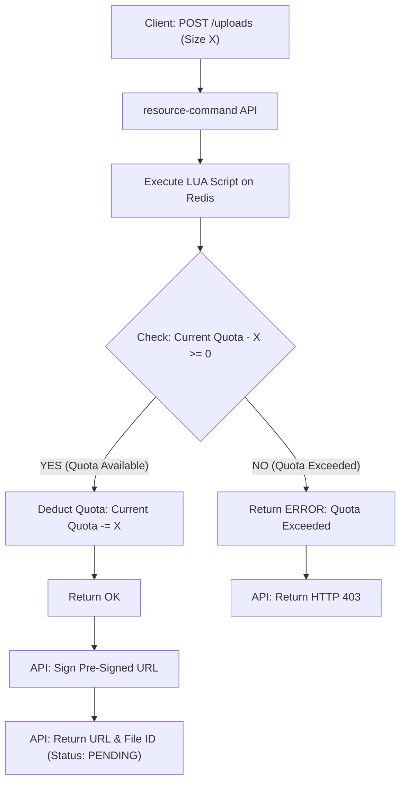
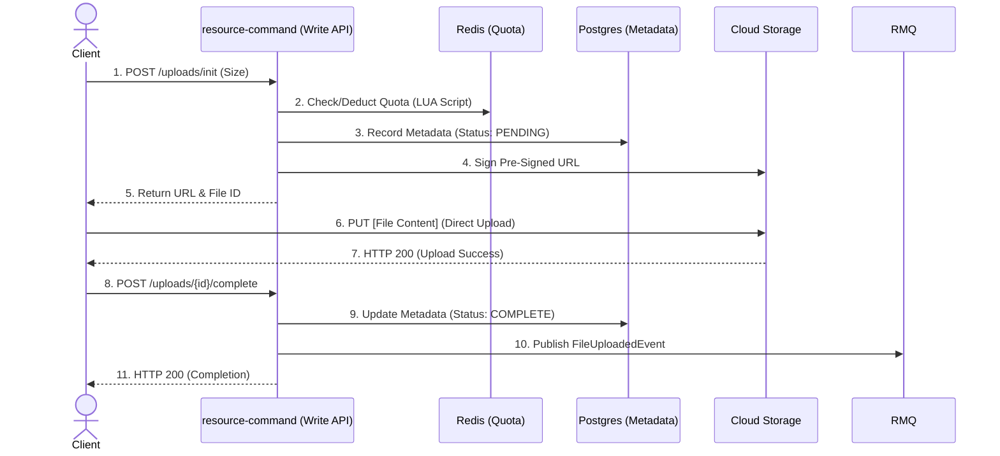

# Kiến trúc Bounded Context Quản lý Tài nguyên (RM)

## 1. Giới thiệu và Phạm vi

### 1.1. Mục tiêu và Động lực

Tài liệu này mô tả kiến trúc chi tiết cho **Resource Management Service** (Bounded Context), một dịch vụ cốt lõi chịu trách nhiệm quản lý vòng đời (upload, metadata, phân phối) của toàn bộ tài nguyên số trong hệ thống. Kiến trúc được thiết kế để giải quyết thách thức về **hiệu suất I/O** và **tính nhất quán dữ liệu** để hỗ trợ đơn hoặc đa tenant một cách hiệu quả và mạnh mẽ.

Kiến trúc của BC RM tuân thủ và hướng tới các mục tiêu, nguyên tắc chung đã được mô tả trong `docs/architecture.md`. Cụ thể, RM được thiết kế để phù hợp với:

- **Domain-Driven Design (DDD)** và **Clean Architect (Ports & Adapters)** để giữ domain thuần và testable.
- **CQRS + Event Sourcing** cho tách biệt Read/Write và khả năng auditability/replay.
- **Event-Driven Architecture (EDA)** với RabbitMQ làm backbone cho giao tiếp bất đồng bộ.
- **Chiến lược hạ tầng chia sẻ** (shared infra) và multi-tenancy theo các chỉ dẫn chung.
- **Observability & Security**: đảm bảo trace propagation (OTEL) trong metadata sự kiện và áp dụng cơ chế S2S tokens cho dịch vụ nội bộ.

Những điểm trên giúp RM hòa nhập chặt chẽ với bức tranh kiến trúc tổng thể và giảm rủi ro vận hành khi tích hợp với các services khác trong monorepo. Ngoài ra chúng tôi cũng áp dụng các nguyên tắc sau để giải quyết các thách thức đặc thù của quản lý tài nguyên số:

- **Stateless Proxy:** Tối ưu hiệu suất đọc bằng cách sử dụng Pre-Signed URL và Redirect/Stream mà không giữ trạng thái session.
- **Resilience (Khả năng phục hồi):** Sử dụng cơ chế bất đồng bộ (Async) và TTL (Time-To-Live) để tự động dọn dẹp tài nguyên rác.
- **Security First:** Kiểm soát quota Atomic và quét malware tại hạ tầng.

### 1.2. Yêu cầu Chức năng Cốt lõi

- **Quản lý Lưu trữ (Storage Management):**
  - **Direct Upload và Offload I/O:** Hỗ trợ upload trực tiếp lên Storage Layer (S3/MinIO) thông qua Pre-signed URL, giảm tải I/O cho API Service.
  - **Quản lý Trạng thái Vòng đời:** Theo dõi chi tiết vòng đời của tài nguyên qua các trạng thái: `Initializing`, `Scanning`, `Available`, và `Infected`.

- **Kiểm soát Tài nguyên (Resource Control):**
  - **Atomic Quota Reservation:** Sử dụng script để kiểm soát và trừ tạm ứng dung lượng lưu trữ **nguyên tử (Atomic)** ngay lúc khởi tạo upload.
  - **Xử lý File Mồ Côi (Async Cleanup):** Tự động phát hiện và xóa các file đã được cấp URL nhưng không hoàn tất upload thông qua **Delayed Queue**, đồng thời hoàn lại Quota đã trừ.

- **Phân phối và Hiệu suất (Delivery & Performance):**
  - **Phân phối Hybrid Thông minh:** Tự động quyết định cơ chế phân phối: **Stream Proxy** (cho Public/SEO) hoặc **302 Redirect** (cho Private/Security).
  - **Kiểm tra Phân quyền Tốc độ cao (AuthZ):** Thực hiện kiểm soát truy cập ngay tại lớp Proxy bằng cách đọc các Claims JWT (`tid`, `azp`) và Cache ACL, tránh gọi về IAM (Introspection).

- **Bảo mật Chủ động (Proactive Security):**
  - **Quét Virus và Chặn Truy cập:** Triển khai Antivirus Worker để quét file bất đồng bộ. Service Proxy chủ động **chặn download** các file đang `Scanning` hoặc đã bị `Infected`.

## 2. Lựa chọn và Giải trình Kiến trúc

### 2.1. Sơ đồ Kiến trúc Cấp cao (CQRS/ES)

Kiến trúc tổng thể tách biệt Write Side và Read Side, nhưng khác với IAM, RM không sử dụng Event Sourcing hoàn toàn do tính chất I/O cao:

- **Luồng Ghi (Write Flow):** Client gửi Command đến Write API. Service xử lý logic, tương tác với Storage (S3/MinIO) qua Pre-signed URL, lưu metadata vào Database và publish events tới RabbitMQ.

- **Luồng Đọc (Read Flow):** Proxy Service nhận request, kiểm tra AuthZ qua Redis Cache, và phân phối file thông qua Stream Proxy hoặc 302 Redirect tùy theo visibility (public/private).

### 2.2. Ghi chép Quyết định Kiến trúc (ADRs)

Ngoài việc tuân theo các quyết định kiến trúc chung đã được ghi lại trong [Kiến trúc tổng quan](../architecture.md), các quyết định cụ thể cho BC RM được ghi lại trong các ADR sau:

**ADR-RM-1: Lựa chọn Công nghệ (Technology Stack)**

- **Quyết định:** Sử dụng NestJS, PostgreSQL cho metadata storage, S3/MinIO cho object storage, Redis cho quota management và ACL cache, RabbitMQ cho message bus, và ClamAV cho virus scanning.
- **Lý do:** PostgreSQL đủ cho metadata với ACID guarantees; S3/MinIO tối ưu cho blob storage với pre-signed URL; Redis cung cấp atomic operations cho quota và low-latency cache; ClamAV là giải pháp antivirus open-source đáng tin cậy.

Chi tiết: [ADR-RM-1 — Lựa chọn Công nghệ (Technology Stack)](../adr/ADR-RM-1.md)

\*\*ADR-RM-2: Direct-to-S3 Upload

- **Quyết định:** Áp dụng mô hình Direct-to-S3 Upload với Pre-signed URL.
- **Lý do:** Giảm tải I/O cho API Service và tận dụng băng thông trực tiếp từ client đến storage layer, cải thiện throughput và giảm chi phí compute.

Chi tiết: [ADR-RM-2 — Direct-to-S3 Upload](../adr/ADR-RM-2.md)

**ADR-RM-3: Atomic Quota Management via Redis Lua Script**

- **Quyết định:** Sử dụng Redis Lua Script để thực hiện atomic quota check và reservation.
- **Lý do:** Đảm bảo tính nhất quán (consistency) trong môi trường phân tán với high concurrency, ngăn chặn race conditions và quota overrun.

Chi tiết: [ADR-RM-3 — Atomic Quota Management via Redis Lua Script](../adr/ADR-RM-3.md)

**ADR-RM-4: Hybrid Delivery Strategy**

- **Quyết định:** Triển khai chiến lược phân phối hybrid: Stream Proxy cho public files và 302 Redirect cho private files.
- **Lý do:** Tối ưu hóa SEO và CDN cache cho public files trong khi đảm bảo bảo mật cao với short-lived signed URLs cho private files.

Chi tiết: [ADR-RM-4 — Hybrid Delivery Strategy](../adr/ADR-RM-4.md)

**ADR-RM-5: Stateless Authorization với JWT Claims và Redis Cache**

- **Quyết định:** Implement stateless AuthZ bằng cách đọc JWT claims và cache ACL rules trong Redis.
- **Lý do:** Đạt được low-latency authorization cho millions of requests mà không cần gọi về IAM service, giảm network overhead và tăng throughput.

Chi tiết: [ADR-RM-5 — Stateless Authorization với JWT Claims và Redis Cache](../adr/ADR-RM-5.md)

**ADR-RM-6: Async Cleanup với Delayed Queue**

- **Quyết định:** Sử dụng Delayed Queue (RabbitMQ Delayed Message Exchange) để tự động cleanup orphaned files.
- **Lý do:** Đảm bảo quota được hoàn trả đúng và storage không bị waste bởi incomplete uploads, giảm manual intervention và tăng reliability.

Chi tiết: [ADR-RM-6 — Async Cleanup với Delayed Queue](../adr/ADR-RM-6.md)

## 3. Mô hình Domain (Domain Model - DDD)

### 3.1. Lưu đồ Quản lý Hạn mức Nguyên tử (Atomic Quota Management)

Flowchart này làm rõ logic kiểm tra và trừ Quota trong một thao tác duy nhất bằng Redis Lua Script để loại bỏ hoàn toàn Race Condition.

### 3.2. Lưu đồ Tuần tự: Luồng Tải lên Bảo mật (Secure Direct Upload Flow)

Sơ đồ này minh họa việc giảm tải I/O (bandwith) cho dịch vụ bằng cách chuyển trực tiếp quá trình tải file sang Cloud Storage (S3).

Ghi chú Đặc biệt về Quá trình Bất đồng bộ (Async Process Notes)
Để đảm bảo tính toàn vẹn và an toàn của hệ thống, các quy trình sau diễn ra bất đồng bộ và không được thể hiện trực tiếp trong sơ đồ tuần tự trên:

- Quét Virus (Antivirus Scanning): Khi file được tải lên thành công (S3 Event), hệ thống sẽ gửi một Event Notification. Worker Antivirus sẽ tiêu thụ thông báo này để tiến hành quét virus.
- Dọn dẹp Bất đồng bộ (Async Cleanup): Nếu Client không gọi bước 8. POST /uploads/{id}/complete trong khoảng thời gian quy định (ví dụ: 1 giờ), một Delayed Queue Message sẽ được xử lý bởi resource-cleanup worker. Worker này có trách nhiệm xóa file vật lý khỏi S3 và hoàn trả Quota đã trừ trước đó.

### 3.3. Tổng quan Aggregates (ARs)

- **File (AR - Resource):** Đại diện cho một tài nguyên số (object) với đầy đủ metadata và vòng đời. Quản lý liên kết đến S3/MinIO (`storageKey`), quyền truy cập (public/private), kích thước, MIME, trạng thái nghiệp vụ (Initializing/Scanning/Available/Deleted) và trạng thái antivirus.

- **StoragePolicy (AR - Policy):** Định nghĩa và áp đặt chính sách lưu trữ theo dự án/dịch vụ: hạn ngạch tổng, MIME types được phép, và các ràng buộc liên quan đến upload/phân phối.

### 3.4. Định nghĩa Chi tiết ARs

**File (Aggregate Root - Resource)**

| Trường           | Kiểu dữ liệu      | Mô tả                                                       |
| ---------------- | ----------------- | ----------------------------------------------------------- |
| `fileId`         | UUID              | Định danh duy nhất cho tài nguyên.                          |
| `tenantId`       | UUID (FK)         | Thuộc về tenant/namespace cụ thể.                           |
| `ownerUserId`    | UUID (Nullable)   | Chủ sở hữu là người dùng (khi upload bởi User).             |
| `ownerServiceId` | UUID (Nullable)   | Chủ sở hữu là dịch vụ (khi upload theo luồng S2S).          |
| `fileName`       | String            | Tên gốc của tệp do client cung cấp.                         |
| `mimeType`       | String            | Kiểu nội dung (MIME).                                       |
| `size`           | Integer (bytes)   | Kích thước tệp (dự kiến hoặc thực tế sau xác nhận).         |
| `isPublic`       | Boolean           | Hiển thị công khai (public) hoặc riêng tư (private).        |
| `storageKey`     | String (Unique)   | Khóa/đường dẫn object trong S3/MinIO.                       |
| `status`         | Enum              | One of: `Initializing`, `Scanning`, `Available`, `Deleted`. |
| `avStatus`       | Enum              | One of: `Waiting`, `Scanning`, `Infected`, `Safe`.          |
| `checksum`       | String (Optional) | Băm nội dung (VD: SHA256) phục vụ kiểm toàn vẹn dữ liệu.    |
| `createdAt`      | Timestamp         | Thời điểm khởi tạo.                                         |
| `updatedAt`      | Timestamp         | Thời điểm cập nhật gần nhất.                                |

**StoragePolicy (Aggregate Root - Policy)**

| Trường             | Kiểu dữ liệu    | Mô tả                                        |
| ------------------ | --------------- | -------------------------------------------- |
| `policyId`         | UUID            | Định danh duy nhất của chính sách.           |
| `projectName`      | String          | Tên dự án áp dụng chính sách.                |
| `serviceName`      | String          | Tên dịch vụ áp dụng chính sách.              |
| `maxSize`          | Integer (bytes) | Hạn ngạch dung lượng tổng cho dự án/dịch vụ. |
| `allowedMimeTypes` | String[]        | Danh sách MIME types được phép upload.       |

### 3.5 Domain Events

Phần này liệt kê các Domain Event cốt lõi do các Aggregate trong BC RM phát ra. Các event được thiết kế để nhẹ, immutable và chứa đủ metadata để các Projector/Worker xử lý bất đồng bộ.

- `FileInitialized` — (fileId, tenantId, ownerId?, size, storageKey, presignedMeta)
- `FileUploadConfirmed` — (fileId, actual_size, etags?)
- `FileUploadAborted` — (fileId, reason)
- `FileDeleted` — (fileId, deletedBy, deletedAt)
- `FileScanningStarted` — (fileId, scanRequestId)
- `FileScanningCompleted` — (fileId, avStatus, scannedAt, report?)
- `FileInfected` — (fileId, threatInfo)
- `QuotaReserved` — (tenantId, reservationId, amountBytes)
- `QuotaReleased` — (tenantId, reservationId, amountBytes, reason)
- `StoragePolicyCreated` / `StoragePolicyUpdated` — (policyId, projectName, serviceName, maxSize, allowedMimeTypes)

Mỗi event nên chứa `traceId`/`causationId` metadata để liên kết trace xuyên suốt luồng Command → Event → Worker, và một `streamVersion` hoặc `sequence` trong trường hợp cần replay/ordering.

### 3.6 Value Objects

VO (Value Object) giữ những khái niệm nguyên tử, có validation và normalize trước khi được lưu làm thuộc tính của Aggregate.

- `FileId` (UUID): định danh dạng UUID v4.
- `StorageKey` (string): khóa object trong S3/MinIO; hợp lệ khi không chứa các ký tự điều khiển và có cấu trúc đường dẫn tenant/...; dùng để build presigned URL.
- `Checksum` (string): hash (ví dụ SHA-256) dùng để verify integrity; non-empty, hex string.
- `MimeType` (string): phải là MIME chuẩn (ví dụ `image/png`), dùng để set Content-Type trên presigned upload và validate bên server.
- `FileSize` (integer bytes): >= 0, dùng cho quota reservation và verification khi complete.
- `Visibility` (enum): `public` | `private` — ảnh hưởng đến delivery logic (stream vs redirect) và caching headers.
- `QuotaAmount` (integer bytes): số byte đã reserve/release.

- Các VO triển khai `equals(...)` dựa trên `ValueObject` trong thư viện `packages/domain` để dễ so sánh trong các unit test và khi rehydrate aggregates.
- Thư mục `domains/resource-domain/src/lib/value-objects` chứa cả file `.test.ts` tương ứng — bạn có thể tham khảo các test để biết ví dụ hợp lệ/không hợp lệ cho mỗi VO.

### 3.7. Vòng đời Trạng thái file

| Trạng thái     | Mô tả                   | Hành động Proxy                      |
| :------------- | :---------------------- | :----------------------------------- |
| `Initializing` | Đã cấp URL, chờ upload. | **404 Not Found**                    |
| `Available`    | Sẵn sàng phân phối.     | **200 Stream** hoặc **302 Redirect** |
| `Deleted`      | Đánh dấu xóa mềm.       | **410 Gone**                         |

### 3.8. Vòng đời Trạng thái quét Virus

| Trạng thái | Mô tả                | Hành động Proxy      |
| :--------- | :------------------- | :------------------- |
| `Waiting`  | Đang chờ quét Virus. | theo trạng thái file |
| `Scanning` | Đang quét Virus.     | theo trạng thái file |
| `Infected` | Phát hiện Virus.     | **410 Gone**         |
| `Safe`     | An toàn.             | theo trạng thái file |

## 4. Triển khai CQRS và Workflows

Resource Service áp dụng mô hình CQRS để tách biệt luồng Ghi (Command) và luồng Đọc (Query), nhưng sử dụng **Database/Event Store** làm nguồn chân lý thay vì Event Sourcing hoàn toàn, vì tính chất I/O cao của dịch vụ.

### 4.1. Luồng Ghi (Command Flow): Upload Bền Vững

Luồng này chịu trách nhiệm cho các hành động thay đổi trạng thái (Init, Confirm, Delete) và đảm bảo tính nhất quán của Metadata và Quota.

- **[1] Reserve Quota (Atomic):**
  - **Hành động:** `Resource-Command` gọi **Redis Lua Script (ADR-RM-3)** để kiểm tra và trừ quota tạm ứng (Reservation).
  - **Mục đích:** Đảm bảo **tính nguyên tử** của thao tác, tránh Race Condition khi nhiều yêu cầu upload cùng lúc.
- **[2] Init Record:**
  - **Hành động:** Ghi AR `File` (Metadata) vào Event Store/Database với trạng thái `Initializing`.
  - **Kết quả:** Sinh ra `fileId` duy nhất.
- **[3] Safety Net (Delayed Queue):**
  - **Hành động:** Gửi message `{ fileId, action: 'CHECK_ORPHAN' }` vào **Delayed Queue (ADR-RM-6)** với độ trễ 1 giờ.
  - **Mục đích:** Kích hoạt **Cleanup Worker** để xử lý file mồ côi nếu quá trình upload không được xác nhận.
- **[4] Sign URL:**
  - **Hành động:** Sinh **Pre-signed URL** (ADR-RM-2) kèm các điều kiện bảo mật (Content-Length, Content-Type).
- **[5] Confirm Upload:**
  - **Hành động:** Client gọi Command xác nhận khi upload hoàn tất.
  - **Kết quả:** Chuyển trạng thái `Initializing` -> `Scanning`. Emit `FileUploaded Event` cho các Workers khác.

### 4.2. Luồng Đọc (Query Flow): Smart Proxy

Luồng này là tuyến đường quan trọng về độ trễ (Latency-Critical Path), được tối ưu hóa để phân phối file nhanh và an toàn.

1.  **Authentication & Routing:** Proxy Service nhận request, xác định `TenantId` (tid) và `CallerId` (sub/azp) từ JWT.
2.  **Authorization Check (ADR-RM-5):**
    - Tra cứu nhanh **Redis Cache** để lấy ACL của File (ACL Cache).
    - Kiểm tra `CallerId` có quyền truy cập không. Nếu không, trả về 403.
3.  **State Check:**
    - Kiểm tra `status` của file: Chặn truy cập nếu `Scanning` (423 Locked) hoặc `Infected` (410 Gone).
4.  **Delivery Logic (ADR-RM-4):**
    - **Public Files:** Trả về **200 Stream Proxy** (Reverse Proxy) + cấu hình CDN Cache.
    - **Private Files:** Trả về **302 Redirect** đến S3 Signed URL.

### 4.3. Hệ thống Background Workers

| Worker                | Trigger               | Mục đích                                                      | Chi tiết Kỹ thuật                                                                                           |
| :-------------------- | :-------------------- | :------------------------------------------------------------ | :---------------------------------------------------------------------------------------------------------- |
| **Cleanup Worker**    | Delayed Queue (1 giờ) | Xử lý **File Mồ Côi** và đảm bảo Quota được hoàn lại.         | Tiêu thụ message `{ check_orphan }`. Nếu file vẫn là `Initializing`: Xóa S3, Hoàn Quota (Redis), Update DB. |
| **Antivirus Worker**  | S3 Event Notification | Quét Malware/Virus và cập nhật trạng thái file.               | Lắng nghe Event từ S3. Stream file -> Scan (ClamAV) -> Update `status` về `Available` hoặc `Infected`.      |
| **Quota Sync Worker** | Cronjob (Hàng đêm)    | Sửa sai số Quota (Self-healing) và đảm bảo số liệu chính xác. | Tính tổng `size` đã sử dụng từ Database -> Ghi đè (Overwrite) vào Redis Key.                                |

## 5. Bảo mật và Tính Toàn vẹn Dữ liệu

### 5.1. Quản lý Quota (Atomic Consistency)

- **Tính Nguyên tử:** Sử dụng **Lua Script** (ADR-RM-3) để đảm bảo các thao tác trừ/cộng Quota là nguyên tử, loại bỏ nguy cơ Race Condition.
- **Hoàn Quota Bắt buộc:** Mọi hành động xóa file (do Command, Cleanup hoặc Antivirus) đều phải gọi Redis `DECRBY` để hoàn lại dung lượng đã chiếm dụng.

### 5.2. Hotlinking Guard và Phân phối An toàn

- **Hotlinking Guard:** Cấu hình lớp Gateway/CDN chỉ cho phép các request có `Referer` thuộc Whitelist, đồng thời cho phép **Referer rỗng** để đảm bảo SEO.
- **Chặn Mềm:** Luồng download bị chặn ở trạng thái `Scanning` và `Infected` để bảo vệ người dùng khỏi tải về tài nguyên độc hại.

### 5.3. Bảo vệ Hạ tầng

- **Time-to-Live (TTL):** Tận dụng **S3 Lifecycle Rule** để tự động dọn dẹp các phần `Incomplete Multipart Upload` sau một khoảng thời gian xác định (ví dụ: 1 ngày).

### 5.4. Quy tắc Sinh StorageKey

**Yêu cầu Bắt buộc:** Để ngăn ngừa rủi ro đoán key (Key Guessing) và tấn công ghi đè dữ liệu (Overwrite Attack) thông qua Pre-signed URL, thuật toán sinh `storageKey` phải phải sử dụng **UUID v7**
**Lý do:** Đây là lớp bảo vệ đầu tiên chống lại việc chiếm quyền upload/ghi đè. Pre-signed URL chỉ cho phép truy cập key cụ thể này trên S3, do đó, key phải là bí mật và không thể đoán được.

Xem thêm ghi chép về quyết định kiến trúc[ADR-G9 — Sử dụng UUID v7 cho toàn hệ thống](../adr/ADR-G9.md).

## 6. Tiêu chuẩn Kỹ thuật và Vận hành

### 6.1. Nguyên tắc Bất đồng bộ (Async Principle)

- **Giao tiếp:** Sử dụng **RabbitMQ** làm Message Broker trung tâm cho tất cả các tương tác bất đồng bộ (Antivirus, Cleanup, Event Notification).
- **Idempotency:** Mọi Background Worker phải đảm bảo **tính Idempotency** (thực hiện nhiều lần cho cùng một message vẫn cho ra một kết quả) khi cập nhật trạng thái file và Quota.

### 6.2. Reliability và Self-healing

- **Tự động Sync:** Triển khai **Quota Sync Worker** (Mục 4.3) để đảm bảo sự đồng bộ giữa số liệu Quota trong Redis và tổng dung lượng thực tế trong Database.
- **Monitoring:** Triển khai các metrics chi tiết về độ trễ (latency) của **Proxy Query Flow** và tỷ lệ lỗi (error rate) của **Command Flow**.

### 6.3. Mô hình Triển khai (Docker)

Hệ thống được đóng gói thành các Docker images riêng biệt (từ cùng codebase NestJS) để scale độc lập, tương tự IAM:

- `apps/resource-migration` (Container 0):
  - Chạy migrations cho Postgres, Redis keys (nếu cần seed cấu trúc), và khởi tạo bucket/policy cho S3/MinIO (lifecycle rules, notifications).
  - Chạy một lần khi khởi động (init container trong k8s).

- `apps/resource-command` (Container 1):
  - Chạy NestJS Write API (Command endpoints: init/confirm/delete, quota ops).
  - Chỉ expose endpoints thay đổi trạng thái (POST/PUT/DELETE).
  - Scale theo lưu lượng ghi và p95 latency của Command Flow.

- `apps/resource-query` (Container 2):
  - Chạy NestJS Read API (Proxy/Delivery): kiểm tra AuthZ, trạng thái file, và quyết định Stream vs 302 Redirect.
  - Chỉ expose endpoints GET/HEAD.
  - Scale theo QPS đọc, cache hit-rate, và băng thông egress.

- `apps/resource-cleanup` (Container 3):
  - Chạy background worker tiêu thụ Delayed Queue để dọn file mồ côi và hoàn quota.
  - Scale theo backlog của hàng đợi trễ và thời gian xử lý trung bình.

- `apps/resource-antivirus` (Container 4):
  - Chạy background worker quét virus theo thông báo từ S3/MinIO.
  - Scale theo tốc độ thông báo (object-created) và thời gian quét.

### 6.4. Observability (Giám sát)

- Logging: Sử dụng Pino ghi log JSON ra `stdout` (có `traceId`, `tenantId`, `callerId`, `fileId`, `storageKey`).
- Tracing: Tích hợp OpenTelemetry cho các luồng HTTP → Queue → Workers. Truyền `traceId` trong message headers/metadata; với Direct-to-S3, nhúng `correlationId` (ví dụ `uploadId`) vào object metadata để liên kết log.
- Metrics chính:
  - Proxy: p50/p95 latency, tỉ lệ 200 Stream vs 302 Redirect, cache hit-rate (ACL/route), error rate 4xx/5xx.
  - Command: thời gian ký URL, tỉ lệ reserve quota thành công/thất bại, tỉ lệ confirm trong TTL.
  - Workers: queue lag (cleanup/antivirus), số file mồ côi dọn mỗi khoảng thời gian, thời gian quét AV, DLQ size.
  - Storage: băng thông egress, số đối tượng tạo/ngày, tỷ lệ multipart incomplete.

## 7. Cấu trúc Thư mục Nx Monorepo

Kiến trúc thư mục tuân thủ mô hình phẳng (flat structure) tương tự IAM, ánh xạ trực tiếp các tầng của Clean Architecture/DDD/CQRS để tách biệt rõ ràng giữa Read/Write và Adapters.

| Tên Project                                | Tầng Kiến trúc            | Vai trò                                                                                                                            |
| ------------------------------------------ | ------------------------- | ---------------------------------------------------------------------------------------------------------------------------------- |
| `domains/resource-domain`                  | Domain (Core)             | Aggregate Roots (`File`, `StoragePolicy`), Domain Events, Value Objects.                                                           |
| `interactors/resource-query-interactors`   | Query Side (Read)         | Xử lý Queries (GET/HEAD) cho Proxy/Delivery, bao gồm kiểm tra ACL, trạng thái file, và logic phân phối.                            |
| `interactors/resource-command-interactors` | Command Side (Write)      | Xử lý Commands (POST/PUT/DELETE) cho vòng đời file và quota, bao gồm các handlers và exceptions.                                   |
| `adapters/resource-infrastructure`         | Infrastructure (Adapters) | Tập hợp Adapters: ReadModel (Postgres), Storage (S3/MinIO + PreSigner), Messaging (RabbitMQ), Caching (Redis), Antivirus (ClamAV). |
| `apps/resource-migration`                  | Presentation (Migration)  | Ứng dụng NodeJS: chạy migration, seed Redis keys, thiết lập bucket/policy/lifecycle cho S3.                                        |
| `apps/resource-command`                    | Presentation (Write API)  | NestJS HTTP: Nhận Commands (POST/PUT/DELETE) cho vòng đời file và quota.                                                           |
| `apps/resource-query`                      | Presentation (Read API)   | NestJS HTTP: Proxy/Delivery (GET/HEAD), kiểm tra ACL cache và phát file (stream/redirect).                                         |
| `apps/resource-cleanup`                    | Presentation (Worker)     | NestJS Background: tiêu thụ Delayed Queue, dọn file mồ côi và hoàn quota.                                                          |
| `apps/resource-antivirus`                  | Presentation (Worker)     | NestJS Background: quét virus theo thông báo từ S3/MinIO và cập nhật trạng thái file.                                              |

## 8. Chi tiết Kỹ thuật Cấp thấp (LLD)

Phần này trình bày chi tiết các modules hạ tầng được import trong từng ứng dụng (App) của BC RM, cùng với vai trò và lý do lựa chọn.

### 8.1 **Ứng dụng Presentation: Khởi tạo (App Bootstrap)**

| Ứng dụng (App)       | Vai trò          | Modules Hạ tầng được Import                                            | Rationale                                                                  |
| -------------------- | ---------------- | ---------------------------------------------------------------------- | -------------------------------------------------------------------------- |
| `resource-migration` | Migration        | `ReadModelModule`, `StorageModule`, `CachingModule`                    | Cần chạy migrations DB, seed/cấu hình cache và bucket/policy ban đầu.      |
| `resource-command`   | Write API        | `ReadModelModule`, `StorageModule`, `MessagingModule`, `CachingModule` | Gửi/nhận events, ký URL, quản lý quota và cập nhật metadata.               |
| `resource-query`     | Read API         | `ReadModelModule`, `StorageModule`, `CachingModule`                    | Cần Read Models, kiểm tra ACL cache nhanh, và phát file (stream/redirect). |
| `resource-cleanup`   | Cleanup Worker   | `MessagingModule`, `StorageModule`, `CachingModule`, `ReadModelModule` | Tiêu thụ Delayed Queue, dọn đối tượng mồ côi và hoàn quota an toàn.        |
| `resource-antivirus` | Antivirus Worker | `MessagingModule`, `StorageModule`, `ReadModelModule`                  | Nhận thông báo, quét virus, cập nhật trạng thái file.                      |

### 8.2 API Contract (Endpoints Chi tiết)

## 8.2.1 Quy ước chung

- Các dịch vụ sẽ được triển khai trên subdomain `resources` và nó là multiple host. và query triển khai với path prefix là `query` và command với path prefix là `command`, ví dụ:
  - Write API: `https://resource.project-a.com/command/uploads/init`
  - Read API: `https://resource.project-a.com/query/files/{file_id}`
- Request phải đình kèm `Authorization: Bearer <token>` hoặc cookie accessToken.
- Sử dụng header `Idempotency-Key` cho các POST retryable (ví dụ `uploads/init`)
- Xem thêm thư viện `packages/common` kiểu response chuẩn

## 8.2.2 Trạng thái chính của file

- `Initializing` → `Scanning` → `Available` | `Deleted`
- `av_status`: `Waiting` | `Scanning` | `Safe` | `Infected`

## 8.2.3 Write API (resource-command)

### 8.2.3.1 Upload lifecycle

| Method |                          Path | Mô tả                                                                    | Body                                                                                                                                                     | Success Response                                                                                                                                           |
| ------ | ----------------------------: | ------------------------------------------------------------------------ | -------------------------------------------------------------------------------------------------------------------------------------------------------- | ---------------------------------------------------------------------------------------------------------------------------------------------------------- |
| POST   |               `/uploads/init` | Khởi tạo upload, thực hiện atomic quota reservation (Redis Lua)          | `{ "tenant_id": "uuid", "file_name": "string", "size": 12345, "mime_type": "image/png", "is_public": false, "checksum": "sha256?", "multipart": false }` | `{ "data": { "file_id": "uuid", "presigned_url": "https://...", "storage_key": "tenant/...", "expires_in": 900 }, "meta": { "quota_remaining": 123456 } }` |
| POST   | `/uploads/{file_id}/complete` | Khách xác nhận upload hoàn tất. Có thể bao gồm `etag_list` cho multipart | `{ "actual_size": 12345, "etags": ["etag1"] }`                                                                                                           | `{ "data": { "file_id": "uuid", "status": "Scanning" } }`                                                                                                  |
| POST   |    `/uploads/{file_id}/abort` | Hủy upload chưa hoàn tất (hoàn quota)                                    | `{}`                                                                                                                                                     | `{ "data": { "file_id": "uuid", "status": "Deleted" } }`                                                                                                   |

### 8.2.3.2 File lifecycle management

| Method |                          Path | Mô tả                                                               |
| ------ | ----------------------------: | ------------------------------------------------------------------- |
| DELETE |            `/files/{file_id}` | Đánh dấu xóa mềm + hoàn trả quota (gọi worker thực hiện xóa vật lý) |
| POST   | `/files/{file_id}/visibility` | Chuyển public/private — body `{ "is_public": true }`                |

### 8.2.3.3 Storage policy & admin ops

| Method |                            Path | Mô tả                                                                     |
| ------ | ------------------------------: | ------------------------------------------------------------------------- |
| POST   |             `/storage-policies` | Tạo policy `{ project_name, service_name, max_size, allowed_mime_types }` |
| PUT    | `/storage-policies/{policy_id}` | Cập nhật policy                                                           |
| POST   |            `/quota/recalculate` | (admin) Reconcile quota từ DB để sửa sai (cron/manual)                    |

## 8.2.4 Read / Delivery API (resource-query)

### 8.2.4.1 Metadata & listing

| Method |                            Path |                                               Query | Mô tả                                                                               |
| ------ | ------------------------------: | --------------------------------------------------: | ----------------------------------------------------------------------------------- |
| GET    |              `/files/{file_id}` |                                                     | Trả metadata `file_id, storage_key, size, mime_type, status, av_status, created_at` |
| HEAD   |              `/files/{file_id}` |                                                     | Trả headers (ETag, Content-Length, Cache-Control) hoặc 404/410/423                  |
| GET    |                        `/files` | `tenant_id?, owner_user_id?, status?, page?, size?` | Liệt kê metadata với pagination                                                     |
| GET    | `/storage-policies/{policy_id}` |                                                     | Chi tiết policy                                                                     |

### 8.2.4.2 Download / Delivery

| Method |                        Path |               Query | Mô tả                                                                 |
| ------ | --------------------------: | ------------------: | --------------------------------------------------------------------- | ---------------------------------------------------------------------------------------------------------------------------------------------------------------------------------------------- |
| GET    | `/files/{file_id}/download` | `disposition=inline | attachment`                                                           | Delivery logic: nếu `is_public` → stream (200) + caching; nếu private → 302 Redirect tới presigned URL (TTL ngắn). Nếu trạng thái `Scanning` → 423 hoặc 404 theo policy. Nếu `Infected` → 410. |
| GET    | `/files/{file_id}/redirect` |                     | Trả 302 trực tiếp hoặc JSON `{ "location": "..." }` cho gateway xử lý |

### 8.2.4.3 Antivirus & security

| Method |                            Path | Mô tả                                                     |
| ------ | ------------------------------: | --------------------------------------------------------- |
| GET    |     `/files/{file_id}/security` | Trạng thái quét antivirus (av_status, last_scanned_at)    |
| POST   | `/internal/antivirus/{file_id}` | (internal callback) Cập nhật kết quả scan (safe/infected) |

## 8.2.5 Presigned URL & Multipart

- `POST /uploads/init` trả `presigned_url` hoặc `multipart:true` + `part_size`.
- Presigned constraints: conditions (content-length-range, content-type) và `expires_in` (giờ mặc định 900s).
- Multipart: client upload các part vào S3 → sau đó gọi `complete` với danh sách ETags. Server verify checksum/size.

## 8.2.6 Quota & Cleanup

- Quota được reserve khi `init` (atomic Redis Lua). Nếu không `complete` trong TTL (ví dụ 1h) → Delayed Queue (RabbitMQ) trigger Cleanup Worker để xóa object và hoàn quota.
- `X-Quota-Remaining` có thể trả trong header/meta.

## 8.2.7 Error codes (chủ yếu)

| HTTP | Code             | Ý nghĩa                                                        |
| ---: | ---------------- | -------------------------------------------------------------- |
|  400 | VALIDATION_ERROR | Payload sai hoặc điều kiện không hợp lệ                        |
|  401 | UNAUTHENTICATED  | Token bị thiếu/hết hạn                                         |
|  403 | FORBIDDEN        | Không có quyền truy cập                                        |
|  404 | NOT_FOUND        | File/policy không tồn tại                                      |
|  409 | CONFLICT         | Quota không đủ / trạng thái không hợp lệ / optimistic conflict |
|  410 | GONE             | File bị xóa hoặc nhiễm virus                                   |
|  423 | LOCKED           | File đang `Scanning`, tạm khóa cho download                    |
|  429 | RATE_LIMITED     | Quá nhiều request                                              |
|  500 | INTERNAL_ERROR   | Lỗi nội bộ                                                     |

## 8.2.8 Idempotency & Concurrency

- `uploads/init` hỗ trợ `Idempotency-Key`: các request trùng key trả cùng `file_id`.
- `uploads/{file_id}/complete` phải idempotent: nhiều lần gọi không làm trùng hành động (lần đầu success, sau trả 409 hoặc success tùy implement), cần document rõ behavior.
- Optimistic concurrency cho metadata update (e.g., `If-Match: <version>` header optional).

## 8.2.9 Delivery semantics & caching

- Public file: `Cache-Control: public, max-age=...`, CDN-friendly headers.
- Private file: use short-lived presigned URL (60–300s), `Cache-Control: no-store`.
- Proxy streaming must forward correct `Content-Length`, `Range` support for partial content.

## 8.2.10 Example flows

### 8.2.10.1 Single-part upload

1. `POST /api/resource/command/v1/uploads/init` → receive `presigned_url`
2. PUT file to `presigned_url`
3. `POST /api/resource/command/v1/uploads/{file_id}/complete`
4. `GET /api/resource/query/v1/files/{file_id}` → status `Scanning`
5. After AV → `GET /files/{file_id}/download` → stream or 302

### 8.2.10.2 Multipart upload

1. `POST /uploads/init` with `multipart=true` → receive upload_id, part_size
2. Client upload parts directly to S3
3. `POST /uploads/{file_id}/complete` with list of ETags
