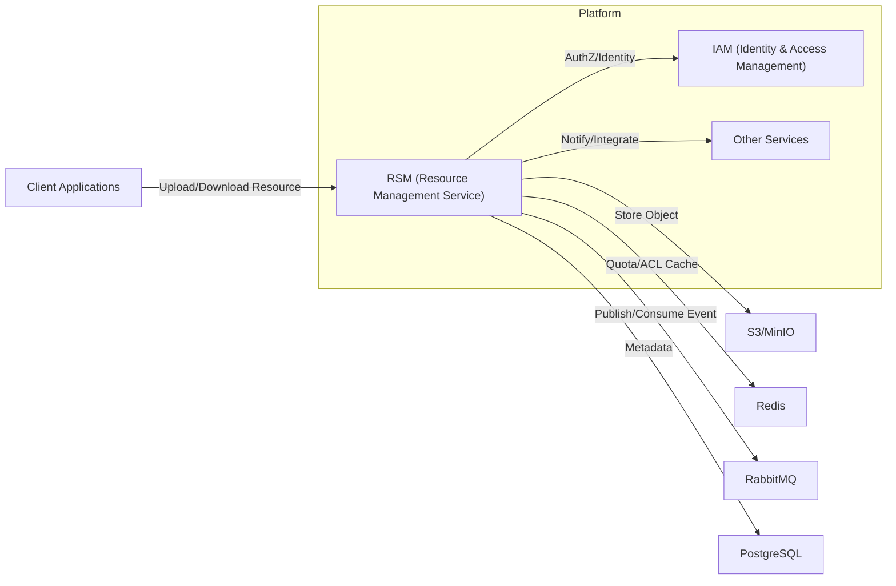
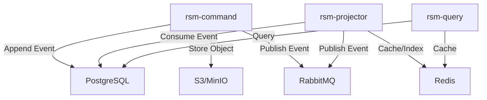

# Kiến trúc Resource Management Service (RSM)

## 1. Mục tiêu & Động lực

RSM (Resource Management Service) là một bounded context độc lập, chịu trách nhiệm quản lý vòng đời tài nguyên số: upload, metadata, phân phối, bảo mật, kiểm soát quota, cleanup tự động. RSM là nguồn chân lý (source of truth) về resource, sử dụng event sourcing (phần metadata) và đảm bảo atomicity cho các thao tác quota, upload, cleanup.

- Quản lý tài nguyên số tập trung, hiệu quả, bảo mật, dễ mở rộng.
- Đảm bảo hiệu suất I/O, tính nhất quán dữ liệu, khả năng tích hợp multi-tenant.
- Hỗ trợ các quy trình nghiệp vụ: upload trực tiếp, phân phối thông minh, quét virus, cleanup tự động, quota management.
- Tích hợp chặt chẽ với các BC khác qua event và read model.

## 2. Yêu cầu chức năng và phi chức năng

### 2.1. Yêu cầu chức năng

- [Upload Resource](./rsm-use-cases.md#upload-resource-direct-upload)
- [Storage Quota Management](./rsm-use-cases.md#quản-lý-quota-lưu-trữ)
- [Resource Delivery](./rsm-use-cases.md#phân-phối-tài-nguyên-resource-delivery)
- [Antivirus Scanning](./rsm-use-cases.md#quét-virus-tự-động)
- [Orphan File Cleanup](./rsm-use-cases.md#cleanup-file-mồ-côi)

### 2.2. Yêu cầu phi chức năng (SLO/SLI)

- **SLO về tính sẵn sàng:** Đảm bảo 99,95% thời gian hoạt động hàng tháng cho API upload/download.
- **SLI về độ trễ:** 95% các yêu cầu upload/download hoàn thành trong vòng 200ms (server-side).
- **SLI về tính nhất quán:** 99% thay đổi metadata/resource được phản ánh lên projection trong vòng 2 giây.
- **SLO về bảo mật:** 100% file được kiểm tra virus trước khi phân phối; quota luôn được kiểm soát atomic.
- **SLO về khả năng mở rộng:** Hỗ trợ tối thiểu 500 thao tác upload/download đồng thời với tỷ lệ lỗi < 1%.
- **SLO về khả năng kiểm toán:** 100% sự kiện vòng đời tài nguyên được ghi log và truy vết đầy đủ.

## 3. Các Nguyên tắc Kiến trúc Cốt lõi (Core Principles)

Dựa trên các mục tiêu trung tâm về hiệu suất, khả năng mở rộng, bảo mật và kiểm toán cũng như các yêu cầu chức năng/phi chức năng đã nêu, kiến trúc BC IAM ngoài việc tuân thủ các nguyên tắc chung trong [Kiến trúc tổng quan](../overview/overview-architecture.md) chúng tôi cũng cũng áp dụng

## 4. Ghi chép Quyết định Kiến trúc (ADRs)

Ngoài việc tuân theo các quyết định kiến trúc chung đã được ghi lại trong [Kiến trúc tổng quan](../overview/overview-architecture.md), các quyết định cụ thể cho BC RM được ghi lại trong các ADR sau:

**ADR-RM-1: Lựa chọn Công nghệ (Technology Stack)**

- **Quyết định:** Sử dụng NestJS, PostgreSQL cho metadata storage, S3/MinIO cho object storage, Redis cho quota management và ACL cache, RabbitMQ cho message bus, và ClamAV cho virus scanning.
- **Lý do:** PostgreSQL đủ cho metadata với ACID guarantees; S3/MinIO tối ưu cho blob storage với pre-signed URL; Redis cung cấp atomic operations cho quota và low-latency cache; ClamAV là giải pháp antivirus open-source đáng tin cậy.

Chi tiết: [ADR-RM-1 — Lựa chọn Công nghệ (Technology Stack)](../adr/ADR-RM-1.md)

\*\*ADR-RM-2: Direct-to-S3 Upload

- **Quyết định:** Áp dụng mô hình Direct-to-S3 Upload với Pre-signed URL.
- **Lý do:** Giảm tải I/O cho API Service và tận dụng băng thông trực tiếp từ client đến storage layer, cải thiện throughput và giảm chi phí compute.

Chi tiết: [ADR-RM-2 — Direct-to-S3 Upload](../adr/ADR-RM-2.md)

**ADR-RM-3: Atomic Quota Management via Redis Lua Script**

- **Quyết định:** Sử dụng Redis Lua Script để thực hiện atomic quota check và reservation.
- **Lý do:** Đảm bảo tính nhất quán (consistency) trong môi trường phân tán với high concurrency, ngăn chặn race conditions và quota overrun.

Chi tiết: [ADR-RM-3 — Atomic Quota Management via Redis Lua Script](../adr/ADR-RM-3.md)

**ADR-RM-4: Hybrid Delivery Strategy**

- **Quyết định:** Triển khai chiến lược phân phối hybrid: Stream Proxy cho public files và 302 Redirect cho private files.
- **Lý do:** Tối ưu hóa SEO và CDN cache cho public files trong khi đảm bảo bảo mật cao với short-lived signed URLs cho private files.

Chi tiết: [ADR-RM-4 — Hybrid Delivery Strategy](../adr/ADR-RM-4.md)

**ADR-RM-5: Stateless Authorization với JWT Claims và Redis Cache**

- **Quyết định:** Implement stateless AuthZ bằng cách đọc JWT claims và cache ACL rules trong Redis.
- **Lý do:** Đạt được low-latency authorization cho millions of requests mà không cần gọi về IAM service, giảm network overhead và tăng throughput.

Chi tiết: [ADR-RM-5 — Stateless Authorization với JWT Claims và Redis Cache](../adr/ADR-RM-5.md)

**ADR-RM-6: Async Cleanup với Delayed Queue**

- **Quyết định:** Sử dụng Delayed Queue (RabbitMQ Delayed Message Exchange) để tự động cleanup orphaned files.
- **Lý do:** Đảm bảo quota được hoàn trả đúng và storage không bị waste bởi incomplete uploads, giảm manual intervention và tăng reliability.

Chi tiết: [ADR-RM-6 — Async Cleanup với Delayed Queue](../adr/ADR-RM-6.md)

## 5. Context Map / Integration

## 6. Mô hình triển khai

- `domains/rsm-domain` : Mô tả entity, value object, aggregate root, domain events của RSM. Lõi business/domain logic độc lập framework.
- `interactors/rsm-command-interactor` : Use-cases và command handler (upload, delete, confirm, scan, cleanup, quota...). Orchestration business, validation, quyết định append event vào EventStore/DB.
- `interactors/rsm-query-interactor` : Use-cases cho read-model queries, mapping giữa read model và các request nghiệp vụ phức tạp.
- `interactors/rsm-projector-interactor` : Logic projection: chuyển event -> cập nhật read model, checkpoint/snapshot, idempotency, enrich/audit provenance.
- `adapters/rsm-command-adapter` : Kết nối hạ tầng cho command side (HTTP, gRPC, EventStore append helpers, quota helpers).
- `adapters/rsm-query-adapter` : Kết nối hạ tầng cho query side (Postgres, Redis, API layer).
- `adapters/rsm-projector-adapter` : Subscription/lifecycle management cho projection (consume event, checkpoint, retry). Gọi interactor để transform logic.
- `adapters/rsm-shared-adapter` : Thư viện dùng chung (serializers, event envelope types, security helpers, validators).
- `apps/rsm-command` : Entrypoint/service cho command side — wiring, config, health checks, metrics.
- `apps/rsm-query` : Entrypoint/service cho query side — read-only APIs, caching, search endpoints.
- `apps/rsm-projector` : Entrypoint/service cho projector process — chạy subscriptions, xử lý stream, forward side-effects.

## 7. Tài liệu tham khảo

- [RSM Domain Model](./rsm-domain-model.md)
- [RSM Use Cases](./rsm-use-cases.md)
- [RSM Roadmap](./rsm-roadmap.md)
- [ADR Index](./ADR-INDEX.md)
